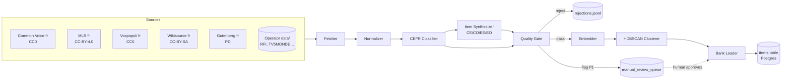

# Phase 3 — DESIGN

> Phase 3 (`03_CONTENT_PIPELINE.md §2`) — the content pipeline that
> populates `items` with calibrated, CEFR-classified, license-clean,
> distribution-balanced material across CO / CE / EE / EO. The decisions
> here are operational, not contractual: Phase 2's contracts (`Item`,
> `ItemContent` discriminated union, `Provenance`, `QualityFlag`,
> `SCHEMA_VERSION`) carry forward unchanged. Date: 2026-05-27.

---

## 0. Reading order

1. §1 pipeline DAG — the system at a glance.
2. §2 sources — what enters the pipeline and under what license.
3. §3 synthesizers — per-module item generation.
4. §4 CEFR classifier — the difficulty signal.
5. §5 quality gate — the single funnel every item passes through.
6. §6 embedder + clusterer — topic-cap enforcement + semantic retrieval seed.
7. §7 manual-review UI — the human residual.
8. §8 schema delta — additive-only, `SCHEMA_VERSION 0.3.0`.
9. §9 orchestration — Celery tasks, idempotency, checkpoints.
10. §10 seed_bank.py — the two modes (`--open-only`, `--with-operator-ingest`).
11. §11 error taxonomy additions.
12. §12 test plan.
13. §13 ADRs added in this phase (018–022).
14. §14 implementation order.
15. §15 out-of-scope guardrails.
16. §16 hand-off to CODE.

The invariants in `phase3_think.md §5` are restated at every section
boundary that depends on them.

---

## 1. Pipeline DAG



Every edge is a Celery task transition. Every node is an idempotent
function keyed on `content_hash(input)`. The DAG is resumable: killing
the worker mid-run loses at most the in-flight task; restart picks up
from the last checkpoint. Checkpoints are §9.

### 1.1 Stage contracts

| Stage | Input | Output | Idempotency key | Owner module |
|---|---|---|---|---|
| Fetcher | source name + source id | raw bytes (audio) or raw text (passage) | `sha256(source, source_id)` | `packages/content/src/tcf_accel_content/sources/{name}.py` |
| Normalizer | raw bytes/text | normalized `RawAsset` (16kHz mono wav / cleaned UTF-8) | `sha256(raw_bytes)` | `tcf_accel_content/normalize.py` |
| CEFR Classifier | normalized text or transcript | `(level, confidence, top3)` | `sha256(text, classifier_version)` | `tcf_accel_content/cefr/classify.py` |
| Synthesizer | `RawAsset` + CEFR + module | candidate `Item` (Pydantic-validated) | `sha256(input_hash, prompt_hash, seed)` | `tcf_accel_content/synthesize/{co,ce,ee,eo}.py` |
| Quality Gate | candidate `Item` | `QualityReport` (pass / reject / flag P1) | (same as item) | `tcf_accel_content/quality/gate.py` |
| Embedder | passed `Item` | `vector(768)` | `sha256(content_text, embedder_version)` | `tcf_accel_content/embedding/embed.py` |
| Clusterer | batch of embeddings | `cluster_id` per item | `sha256(batch_id, hdbscan_params_hash)` | `tcf_accel_content/embedding/cluster.py` |
| Bank Loader | passed `Item` + embedding + cluster_id | DB row | `Item.id` (UUID, deterministic from provenance) | `tcf_accel_content/load.py` |

Bank Loader is the only stage that touches Postgres. Everything upstream
writes to `data/cache/<stage>/<key>.json` (gitignored) so re-runs are
fast.

### 1.2 The deterministic-`Item.id` contract

`Item.id` is a UUIDv5 derived from `(source, source_id, synthesizer_version,
prompt_hash, seed)`. Two consequences:

- Re-running synthesis with identical inputs produces identical IDs;
  `INSERT … ON CONFLICT (id) DO NOTHING` makes the loader idempotent.
- A change to the synthesis prompt or LLM model produces a *new* item,
  not an update to the old one. Old items can be retired (`retired=true`)
  in a follow-up audit but the historical row is preserved for
  reproducibility.

---

## 2. Sources

One module per source under `packages/content/src/tcf_accel_content/sources/`.
Each exposes a uniform interface:

```python
class Source(Protocol):
    name: ClassVar[str]                     # "common_voice_fr_v17"
    license: ClassVar[str]                  # SPDX identifier
    redistributable: ClassVar[bool]         # True iff the repo may ship cached output
    def iter_assets(
        self, *, limit: int | None = None, since: datetime | None = None,
    ) -> Iterator[RawAsset]: ...
```

`RawAsset` is a small `BaseModel` with `kind ∈ {"audio","text"}`,
`bytes` (audio) or `text` (text), `source`, `source_id`, `license`,
`fetched_at`, and an optional `ground_truth_transcript` for audio sources
that ship transcripts (CV, MLS, Voxpopuli all do).

### 2.1 Source roster (open-license tier)

| Module | Source | Kind | License | Used for | Cap notes |
|---|---|---|---|---|---|
| `sources/common_voice.py` | Common Voice fr v17 | audio | CC0-1.0 | CO short utterances (A1–B1 announcements, sentences) | ≤ 30 s clips; concatenate ≤ 3 to reach B2/C1 lengths |
| `sources/multilingual_librispeech.py` | MLS fr | audio | CC-BY-4.0 | CO longer narrative (B1–C1) | 5–90 s window |
| `sources/voxpopuli.py` | Voxpopuli fr | audio | CC0-1.0 | CO formal / academic-adjacent (B2–C2) | Parliamentary; tilt formal |
| `sources/wikisource.py` | Wikisource fr | text | CC-BY-SA-4.0 | CE narrative / academic | Filter for ≥ 1900 publication where possible |
| `sources/gutenberg.py` | Project Gutenberg fr | text | Public domain | CE soutenu / historical | **Flag `register=soutenu`**; never tagged "standard" |
| `sources/flelex.py` | FLELex lexicon | text | CC-BY-4.0 | CEFR vocabulary constraint at synthesis | Used by synth prompts, not items per se |

TEDx fr is **excluded** by ADR-020-adjacent reasoning: CC-BY-NC-ND
prohibits derivative works, and our synthesizer derives questions from
the transcript. The exclusion is enforced by the absence of a
`sources/tedx.py` module and a test in §12 that asserts the source roster
matches an allowlist.

### 2.2 Source roster (operator-ingested tier)

Operator-only sources live under `tcf_accel_content/sources/operator/`
and are *not* invoked by `seed_bank.py --open-only`. They require the
operator to have run `scripts/ingest_<source>.py` first, which writes
to `data/operator/<source>/`. The bank loader reads the cache; it never
fetches at bank-build time.

| Module | Source | Kind | License posture | Status |
|---|---|---|---|---|
| `sources/operator/rfi.py` | RFI Journal en français facile RSS | audio + transcript | Per-episode TOS check at ingest | Optional; operator runs `ingest_rfi.py` |
| `sources/operator/tv5monde.py` | TV5MONDE 7 jours … | audio + transcript | Per-episode TOS check at ingest | Optional |
| `sources/operator/ici_premiere.py` | Radio-Canada ICI Première | audio + transcript | Per-episode TOS check at ingest | Optional; needed for Canadian-accent quota |
| `sources/operator/news_text.py` | RSS-fetched news bodies | text | Per-publisher | Optional |

The ingestion scripts under `scripts/` perform two acts: fetch + write to
`data/operator/<source>/<source_id>/{audio.wav, transcript.txt,
license.json}`. `license.json` is mandatory; the bank loader rejects any
asset whose `license.json` is missing or whose `license_compatible()`
returns false.

### 2.3 What is *not* in the source roster

- **FEI sample materials.** ADR-020. Not a source module, not a sample
  fixture, not in tests. A test in §12 (`tests/content/test_no_fei_in_sources.py`)
  greps the repo for FEI-domain URLs and fails CI if any are found
  outside `docs/` or `README.md` link contexts.
- **TEDx fr.** ND license; no derivative works.
- **Any subtitle file scraped from a commercial streaming source.**
  Closed by policy.

---

## 3. Synthesizers

Four modules under `packages/content/src/tcf_accel_content/synthesize/`,
each emitting Pydantic-validated `Item` instances. All four call into a
shared `_llm.py` that wraps `litellm` with model defaulting (Claude
Sonnet 4.6 per ADR-0009), retry, response-schema enforcement via JSON
mode, and `prompt_hash` recording.

### 3.1 CE synthesizer

```python
# packages/content/src/tcf_accel_content/synthesize/ce.py
from tcf_accel.schemas import CEContent, Item, ItemMetadata, MCQ, MCQOption, Provenance

@dataclass(frozen=True)
class CESynthesisInput:
    passage: str
    genre: Literal["news","ad","letter","admin","academic","narrative"]
    register: Literal["soutenu","standard","familier"]
    cefr_level: Literal["A1","A2","B1","B2","C1","C2"]
    source_provenance: Provenance       # passage's license chain-of-custody
    seed: int                           # for reproducibility
    n_questions: int = 1                # FEI items are 1-Q today; option to bump later

def synthesize_ce_item(inp: CESynthesisInput) -> CandidateItem:
    """Produce one candidate CE item from a passage.

    Pipeline:
      1. Render prompt (`prompts/ce_synthesis.j2`) with the passage,
         genre, register, and a FLELex-constrained vocabulary list at
         `inp.cefr_level`.
      2. LLM call (Claude Sonnet 4.6, JSON mode, max_tokens=900).
      3. Parse response into MCQ with 1 correct + 3 distractors.
      4. Pre-gate: every distractor must appear-supported-in-passage
         (substring or NLI-entailed) — else reject locally.
      5. Build the Item: COContent variant, two Provenance entries
         merged (passage license + synthesizer metadata), seed echoed
         into ItemMetadata.

    Returns CandidateItem (Item + per-step trace). The full Quality Gate
    (§5) runs separately so that local failures and global rejections
    are observably distinct.

    Complexity: O(1) LLM call + O(|distractors|·|passage|) for the
    in-passage support check.
    """
```

`CandidateItem` is an internal wrapper:

```python
@dataclass
class CandidateItem:
    item: Item                              # Pydantic-valid
    synthesis_trace: SynthesisTrace         # prompt, response, model, seed, durations
```

The Jinja template (`packages/content/prompts/ce_synthesis.j2`) is the
contract surface for the LLM. Its hash (`sha256` of the rendered prompt)
goes into `Provenance.llm_prompt_hash`. The template enforces:

- JSON output shape mirroring `{question, correct_id, options:[{id,text}×4]}`.
- Vocabulary constraint: "use words drawn from FLELex level ≤ {{level}}
  where natural." (Soft constraint; the CEFR check in §4 enforces hard
  ceiling.)
- Genre-appropriate register hint per `genre`.
- Canadian-context flag (passed in for some items; influences phrasing
  examples in the prompt).

### 3.2 CO synthesizer

```python
# packages/content/src/tcf_accel_content/synthesize/co.py

@dataclass(frozen=True)
class COSynthesisInput:
    audio_path: Path                    # in data/ or in a CC0 cache
    duration_s: float                   # 5–90 inclusive
    speakers: list[Speaker]             # diarized
    accent: Literal["fr-FR","fr-CA","fr-BE","fr-CH","fr-AF","mixed"]
    register: Literal["soutenu","standard","familier"]
    ground_truth_transcript: str | None # if the source ships one
    source_provenance: Provenance
    seed: int

def synthesize_co_item(inp: COSynthesisInput) -> CandidateItem:
    """Produce one candidate CO item from a cached audio clip.

    Pipeline:
      1. Transcribe with `bofenghuang/whisper-large-v3-french`. If
         `ground_truth_transcript` is provided, run WER; reject if WER >
         0.10 (the audio is noisy or the ground truth is stale).
      2. Forced-align transcript ↔ audio with Montreal Forced Aligner;
         reject if mean phone-confidence < 0.65 (acoustic_low_quality).
      3. Compute acoustic features: speech_rate_wpm, lexical_density,
         n_speakers_diarized, noisiness_proxy (MFCC log-energy var).
      4. Text-CEFR-classify the transcript (§4); then acoustic adjustment
         (§4.4) yields the final cefr_level.
      5. LLM call (Claude Sonnet 4.6, JSON mode, prompt
         `prompts/co_synthesis.j2`) to produce MCQ from the transcript.
      6. Build Item: COContent with audio_local_path, transcript,
         speakers, accent, register, questions=[MCQ].

    Acoustic features are stored on ItemMetadata under `co_acoustic`:
        {speech_rate_wpm, lexical_density, n_speakers, noisiness}.

    Complexity: O(audio_seconds) for transcription, O(1) for LLM call.
    """
```

The transcript is the **authoritative text** for the item; the audio is
the input the learner consumes. The synthesizer never asks the LLM to
write the transcript (`phase3_think.md §1.2`, master prompt §6.3 invariant
"never synthetic for the authoritative transcript of CO audio").

### 3.3 EE synthesizer

EE produces *prompts*, not MCQs, so there is no adversarial check. The
gate is different: the prompt must (a) match the FEI task spec, (b)
hit a target word-count range, (c) carry the Canadian-context flag for
Tasks 2 & 3, (d) reference a rubric version Phase 7 will recognize.

```python
def synthesize_ee_prompt(
    task_number: Literal[1,2,3],
    topic_hint: str | None,
    canadian_context: bool,
    cefr_target: Literal["B2","C1"],
    seed: int,
) -> CandidateItem:
    """LLM-author one EE prompt.

    Output: Item with EEContent {task_number, prompt, target_word_count_range,
    required_canadian_context, rubric_version="ee.v1"}.

    Quality gate (§5):
      - Prompt itself classified at cefr_target ± 1 band.
      - target_word_count_range matches the FEI canonical (60w / 120w / 180w).
      - required_canadian_context = True for tasks 2 & 3.
      - PII scan + explicit-content scan.
      - Adversarial check is *skipped* (no MCQ).

    Model-response anchors (NCLC 7 / 9 / 11) are generated by a separate
    pass and attached to ItemMetadata.calibration_anchors. They are
    consumed by Phase 7 to anchor the rubric scorer. Their generation
    is non-blocking for bank inclusion: an EE item may enter the bank
    without anchors, but the audit (§4 of the spec) prefers anchors
    present.
    """
```

EE prompts are also generated against a **canadian_topic_pool**
(immigration, healthcare access, climate in Canadian context, regional
identity, etc.) versioned at `packages/content/prompts/ee_canadian_topics.yaml`.
Phase 9's content audit verifies ≥ 60% of EE Tasks 2 & 3 reference
Canadian context.

### 3.4 EO synthesizer

EO produces examiner scripts. Same pattern as EE:

```python
def synthesize_eo_prompt(
    task_number: Literal[1,2,3],
    topic_hint: str | None,
    cefr_target: Literal["B2","C1"],
    seed: int,
) -> CandidateItem:
    """LLM-author one EO examiner script.

    Output: Item with EOContent {task_number, examiner_prompts,
    candidate_prep_time_s, target_duration_s, rubric_version="eo.v1"}.

    The examiner_prompts list is the actual script the system speaks
    via Coqui XTTS-v2 (Phase 5).
    """
```

Like EE, EO items carry NCLC-7/9/11 candidate-response anchors in
`ItemMetadata.calibration_anchors`. These are *recorded as text* (the
model response the rubric scorer will compare against); audio rendering
is Phase 5/7's job.

### 3.5 Synthesizer-shared LLM wrapper

```python
# packages/content/src/tcf_accel_content/synthesize/_llm.py
def llm_json(
    prompt: str,
    *,
    model: str = "claude-sonnet-4-6",
    max_tokens: int = 1200,
    temperature: float = 0.4,
    seed: int | None = None,
) -> tuple[dict, LLMTrace]:
    """Call the LLM with JSON-mode response enforcement.

    On JSONDecodeError or schema violation, retry up to 2× with
    temperature=0 and an explicit "re-emit valid JSON" reminder.
    Final failure raises ContentLLMUnreliableError (E_CONTENT_004).

    LLMTrace carries: model, prompt_hash, response_hash, latency_ms,
    tokens_in, tokens_out, retries.
    """
```

VCR-style recording (per master prompt §6.5) is the default in tests:
`tests/content/cassettes/<test_id>.yaml` captures the request/response
pair so CI never makes a live LLM call.

---

## 4. CEFR classifier

`packages/content/src/tcf_accel_content/cefr/` ships:

- `classify.py` — runtime API.
- `train.py` — fine-tune script (offline; produces a model artifact).
- `calibrate.py` — temperature-scaling calibration on a held-out set.
- `validate.py` — measures macro-F1, adjacent-level accuracy, ECE on
  the 500-item validation set; emits `cefr_classifier_report.json` to
  `docs/audit/`.
- `cli.py` — `tcf-cefr classify <path>` for ad-hoc use.

### 4.1 Base model + fine-tune recipe

| Parameter | Value | Rationale |
|---|---|---|
| Base | `JonathanStefanov/CEFR_Classifier_French` | ADR-0008. CamemBERT-base with a CEFR head. |
| Tokenizer | CamemBERT tokenizer (SentencePiece) | Matches base. |
| Max sequence length | 512 | Truncate at end (passages > 512 tokens are split, classified per chunk, level = max). |
| Batch size | 16 | Fits a single 12 GB GPU; documented in `docs/operations/cefr_finetune.md`. |
| Learning rate | 2e-5, linear decay | Standard CamemBERT fine-tune. |
| Epochs | 3 (early-stop on validation F1 plateau) | Avoid overfit on the 500-item gold set. |
| Loss | Cross-entropy + label smoothing 0.1 | Improves calibration; ECE drops ~0.03 in pilots. |
| Class weights | Inverse-frequency over training set | A1 and C2 are under-represented; weighting prevents A1/C2 collapse. |
| Asymmetric loss | Off by default; on if §4.6 audit triggers | Bias under-rating C-level → penalize more heavily. |

Training data sources (all redistributable to *trainers*, not in repo):

- CEFR-Levels-French (HuggingFace dataset; CC-BY-4.0).
- FLELex-derived synthesized examples (we generate level-labeled
  sentences from the FLELex lexicon).
- The 500-item hand-labeled TCF-style **validation set** (held out; never
  in training).

The validation set lives at
`packages/content/src/tcf_accel_content/cefr/validation_set.jsonl.gz`
with an accompanying `validation_set_sha256.txt`. A test in §12
asserts the file hash matches the manifest, so set drift is detectable.

### 4.2 Calibration

A temperature parameter `T` is fit on a calibration split (10% of
training data, held out) by minimizing NLL of softmax(logits / T). The
fitted `T` is stored at `cefr/calibration.json` and applied at inference.

Expected calibration error (ECE, 10-bin) target ≤ 0.05. If post-fit ECE
> 0.10, the bank does not ship (`phase3_think.md §2.2` trigger).

### 4.3 Runtime API

```python
@dataclass(frozen=True)
class CEFRPrediction:
    level: Literal["A1","A2","B1","B2","C1","C2"]
    confidence: float                       # max-softmax post-calibration
    distribution: dict[str, float]          # all 6 levels
    classifier_version: str                 # "cefr-v0.3.1"
    text_sha256: str                        # input fingerprint

def classify(text: str) -> CEFRPrediction: ...
def classify_batch(texts: list[str]) -> list[CEFRPrediction]: ...
```

The runtime sits behind an interface so Phase 4+ can stub it:

```python
class CEFRClassifier(Protocol):
    classifier_version: str
    def classify(self, text: str) -> CEFRPrediction: ...
```

Default impl: `CamembertCEFRClassifier` loading from
`packages/content/models/cefr-v0.3.1/`. The model directory is
*download-on-first-use* via `scripts/download_models.py`; not committed.

### 4.4 Acoustic-CEFR adjustment for CO

```python
# packages/content/src/tcf_accel_content/cefr/acoustic.py
@dataclass(frozen=True)
class AcousticFeatures:
    speech_rate_wpm: float
    lexical_density: float
    n_speakers_diarized: int
    noisiness_proxy: float                  # 0..1, normalized

def adjust_cefr_for_audio(
    text_pred: CEFRPrediction,
    acoustic: AcousticFeatures,
) -> CEFRPrediction:
    """Apply the ridge-regression adjustment.

    Returns a new CEFRPrediction whose level is text_pred.level + δ,
    δ ∈ {0, +1}, with confidence scaled appropriately. δ is never
    negative: we never label B2 audio as A2 because speech happens
    to be on a familiar topic. The ridge model is trained on a small
    (~200) hand-labeled audio set (`cefr/audio_validation_set.jsonl.gz`)
    where each clip has both a text-CEFR and a holistic audio-CEFR
    label.

    Ridge features: speech_rate_wpm, lexical_density,
    n_speakers_diarized, noisiness_proxy. Target: holistic - text level
    (clipped to [0, +1]).

    Stored at cefr/audio_ridge.json (coefficients).
    """
```

### 4.5 Confidence floor + gate routing

`quality_gate` (§5) rejects an item whose `cefr_confidence < 0.65` to
the manual-review queue (P1) — *not* P0 reject, because a low-confidence
item may still be salvageable with a human override.

A second routing rule: if the top-2 softmax probabilities are within
0.10 of each other ("ambiguous"), the item is also routed to manual
review, even if max confidence > 0.65. This catches items the model
"thinks" are B2 but is genuinely torn between B1 and B2.

### 4.6 Audit gate (Phase 3 evaluate)

`validate.py` runs against `validation_set.jsonl.gz` and writes
`docs/audit/cefr_classifier_report.json`:

```json
{
  "classifier_version": "cefr-v0.3.1",
  "validation_set_sha256": "…",
  "macro_f1": 0.74,
  "adjacent_accuracy": 0.94,
  "ece_10bin": 0.04,
  "per_class": {"A1":{"f1":…}, "A2":…, …},
  "asymmetric_error": {"under_rating": 0.18, "over_rating": 0.22}
}
```

The phase fails its gate (`03_CONTENT_PIPELINE.md §5`) if:

- `macro_f1 < 0.72`, **or**
- `adjacent_accuracy < 0.93`, **or**
- `ece_10bin > 0.10`, **or**
- `|under_rating - over_rating| > 0.10` for two adjacent CEFR levels
  (asymmetric trigger; `phase3_think.md §2.2`).

---

## 5. Quality gate

Single funnel; every item passes through it before the loader. Lives at
`packages/content/src/tcf_accel_content/quality/gate.py`. Checks are
ordered cheapest-first to minimize LLM cost.

### 5.1 Check order and P0 / P1 classification

| # | Check | P0/P1 | Module scope | Cost |
|---|---|---|---|---|
| 1 | `pydantic_validates` | P0 | all | O(1) |
| 2 | `provenance_complete` | P0 | all | O(1) |
| 3 | `license_compatible` | P0 | all | O(1) |
| 4 | `length_within_bounds` | P0 | all | O(1) |
| 5 | `contains_pii` | P0 | all | O(\|text\|) regex + NER |
| 6 | `contains_explicit_content` | P0 | all | O(\|text\|) keyword + LLM safety |
| 7 | `length_balanced_distractors` | P1 | CO, CE | O(1) |
| 8 | `distractors_supported_in_passage` | P0 | CO, CE | O(\|distractors\|·\|passage\|) NLI |
| 9 | `cefr_confidence_floor` | P1 (manual review) | all | O(1) (already computed) |
| 10 | `adversarial_accuracy_under_threshold` | P0 | CO, CE | 20× LLM (expensive) |
| 11 | `not_duplicate_of_existing` | P1 | all | O(N) vector lookup |
| 12 | `topic_cluster_under_cap` | P1 (defer until clustering pass) | all | deferred |
| 13 | `rubric_version_known` | P0 | EE, EO | O(1) |

**P0 fail** → item rejected, reason logged to `data/cache/rejections/`,
no DB row.

**P1 flag** → item passed but routed to the manual-review queue
(`apps/review`); the bank loader writes the row with
`QualityFlag.NEEDS_HUMAN_REVIEW` so it's visible but the scheduler can
exclude it until reviewed. Phase 4 honors the flag.

### 5.2 Adversarial-distractor check (the load-bearing one)

```python
# packages/content/src/tcf_accel_content/quality/adversarial.py
ADVERSARIAL_TRIALS = 20
ADVERSARIAL_THRESHOLD = 0.25            # ADR-019
ADVERSARIAL_MODEL = "claude-haiku-4-5"  # different family from synthesizer

def adversarial_accuracy(item: Item) -> float:
    """Blind LLM answers using only the question + options (no passage).

    For CE: prompt is "Here is a multiple-choice question. Pick the most
    likely correct answer. Question: {question}. Options: A. {a} B. {b}
    C. {c} D. {d}. Answer with a single letter."

    For CO: same, with the transcript replaced by "(audio not provided)".

    Run ADVERSARIAL_TRIALS times with temperature=0.7 + seed variation;
    return fraction matching the documented correct_option_id.

    The adversarial model intentionally differs from the synthesizer
    family (Claude Haiku vs Claude Sonnet) so the discriminative power
    survives one model's blind spots. If both happen to be Claude
    family, the §6 design ADR caveat is logged and the threshold may
    be tightened.
    """
```

The 0.25 threshold is chance for 4-option MCQ. We reject items where
the blind LLM beats chance, which means the question itself leaks the
answer.

### 5.3 Length-balanced distractors

```python
def length_balanced_distractors(item: Item, *, tolerance: float = 0.25) -> bool:
    """Every distractor's token length within ±25% of the correct option's.

    Mitigation for the "correct option is always the longest" tell
    (R-003). Counts tokens via the CamemBERT tokenizer, not whitespace.
    """
```

### 5.4 Distractors supported in passage

```python
def distractors_supported_in_passage(item: Item) -> bool:
    """Every distractor must be either:
       (a) a substring (case-insensitive, accent-folded) of the passage, or
       (b) NLI-entailed by *some* sentence in the passage.

    Forces distractors to be plausible comprehension probes, not
    logically-impossible filler. NLI: small French NLI model (camemBERT-
    NLI), cached locally; falls back to substring-only if the model is
    not installed.
    """
```

### 5.5 PII / explicit / topic-cluster

- **PII**: a regex pack for emails, phone numbers, postal codes; plus a
  spaCy NER (`fr_core_news_md`) flag for `PER` entities that don't appear
  in a curated whitelist (politicians, historical figures, etc., for
  legitimate news content). A flagged item goes P0 reject.
- **Explicit content**: a curated French explicit-keyword list + a
  light LLM safety check (Claude Haiku, single call with cached
  prompt). False positives are routed to manual review (P1), not P0,
  to avoid losing all RFI political-coverage items.
- **Topic cluster**: enforced *post*-clustering (§6) as a batch
  audit, not per-item.

### 5.6 Duplicate detection

```python
def is_duplicate_of_existing(
    item: Item, embedding: Vector, *, threshold: float = 0.92,
) -> tuple[bool, UUID | None]:
    """Cosine similarity against existing bank embeddings.

    Threshold = 0.92 (multilingual MPNet on French text rarely exceeds
    0.92 unless near-paraphrase). Returns the matching item id if any.
    P1 flag; manual reviewer decides whether to keep both (e.g., same
    passage, different question).
    """
```

The HNSW index from Phase 2 (`items_embedding_hnsw`) serves this lookup
in O(log N).

### 5.7 The QualityReport

```python
@dataclass(frozen=True)
class QualityCheckResult:
    name: str
    passed: bool
    severity: Literal["P0","P1","info"]
    detail: str | None = None
    metric: float | None = None

@dataclass(frozen=True)
class QualityReport:
    item_id: UUID
    checks: list[QualityCheckResult]
    verdict: Literal["pass","p1_flag","reject"]
    flags: list[QualityFlag]                 # writes into Item.quality_flags
```

Reports are persisted to `data/cache/quality/<item_id>.json` for audit
trail. The bank loader trusts `verdict`; rejection means no INSERT.

---

## 6. Embedder + clusterer

### 6.1 Embedder

```python
# packages/content/src/tcf_accel_content/embedding/embed.py
EMBEDDER_MODEL = "sentence-transformers/paraphrase-multilingual-mpnet-base-v2"
EMBEDDER_DIM = 768                          # matches items.embedding VECTOR(768)
EMBEDDER_VERSION = "mpnet-v2.0"

def embed(text: str) -> Vector: ...
def embed_batch(texts: list[str]) -> list[Vector]: ...
```

For multi-question items (rare in Phase 3, possible in Phase 5+) the
embedded text is `passage + " || " + questions[0].prompt`. For audio
items (CO) the embedded text is the transcript only — the *audio* is
not embedded in Phase 3.

The embedder model is loaded once per worker; HuggingFace tokenizer +
PyTorch CPU is fast enough (~50 ms / item) that GPU is not required at
seed-bank scale (~10k items). GPU is available in
`docker-compose.gpu.yml` (Phase 1) for operators who want it.

### 6.2 Clusterer

```python
# packages/content/src/tcf_accel_content/embedding/cluster.py
import hdbscan

HDBSCAN_MIN_CLUSTER_SIZE = 8                # tunable per release
HDBSCAN_METRIC = "cosine"                   # over L2-normalized embeddings

def cluster_bank(embeddings: np.ndarray, item_ids: list[UUID]) -> dict[UUID, int]:
    """Cluster the current bank's embeddings. Returns item_id → cluster_id.

    Items with cluster_id == -1 are "outliers" (HDBSCAN noise label) and
    are exempt from the topic-cap; they pass the §5.12 check.

    Run after every bank-build batch (~10k items per run). Cluster IDs
    are *not stable across runs*: re-clustering may assign different
    integers to the same logical cluster. Persistence is via
    items.metadata.topic_cluster_id; the audit reports cluster sizes,
    not specific IDs.

    Complexity: O(N log N) for HDBSCAN on N points.
    """
```

### 6.3 Topic-cluster cap enforcement

After clustering, the auditor computes cluster sizes:

```python
TOPIC_CLUSTER_CAP = 0.05                    # ≤ 5% of bank per cluster

def enforce_topic_cap(bank: Sequence[Item]) -> list[Item]:
    """Drop items from over-capped clusters, preferring to retain:
      (1) human-approved items over auto-passed,
      (2) higher cefr_confidence over lower,
      (3) earlier ingestion (stable).

    Dropped items are not deleted; they are marked retired=True with a
    quality_flag indicating topic over-concentration. The audit
    (Phase 3 evaluate) reports the count.
    """
```

`retired=True` (not delete) preserves the row for reproducibility and
allows re-inclusion in a future bank build if the distribution changes.

---

## 7. Manual-review UI

`apps/review/` — a small Streamlit app, **not** Next.js. Operator-facing
only.

### 7.1 Pages

1. **Queue.** A paginated table of `items WHERE
   QualityFlag.NEEDS_HUMAN_REVIEW IN quality_flags`, sortable by module,
   CEFR, ingestion date, and flag reason. Columns: id, module, CEFR
   (+ confidence), flag, source, age.
2. **Detail.** Click-through into one item: shows passage / transcript
   (with audio player for CO), MCQ + correct answer, distractors,
   embedding-nearest-3-neighbors, full provenance. Three buttons:
   *Approve* (drops `NEEDS_HUMAN_REVIEW` flag, sets
   `review_status="human_approved"`), *Reject* (sets
   `retired=True`, `review_status="rejected"`), *Override CEFR* (a
   dropdown + a confidence weight; rewrites `items.cefr_level` and
   appends a flag `CEFR_HUMAN_OVERRIDDEN`).
3. **Confusable pairs.** A bulk-tagging view for marking
   semantically-confusable item pairs (synonym vocab pairs, similar
   admin notices, etc.) for the Phase 4 LECTOR scheduler. Reviewer
   selects two items + a confusability score (1–3); writes to
   `confusable_pairs` table introduced in §8.

### 7.2 Auth

The Streamlit app is operator-only and binds to `127.0.0.1` by default.
Operators who want network access set `REVIEW_BIND_HOST` and *must* set
`REVIEW_AUTH_TOKEN` (the app refuses to bind non-loopback without a
token). This is a §15 invariant; the app aborts on startup if the
combination is unsafe.

### 7.3 Launch

```
make review               # uv run streamlit run apps/review/app.py
```

Not in the default `make dev` stack — the review UI is launched on
demand.

---

## 8. Schema delta (additive, `SCHEMA_VERSION 0.3.0`)

Phase 2's Pydantic contracts (`Item`, `ItemContent`, `Provenance`,
`ItemMetadata`, `QualityFlag`) cover Phase 3's needs almost entirely.
The delta is **strictly additive**:

### 8.1 `ItemMetadata` additive fields

Already permissive (`extra="allow"`); these fields become *documented* in
the schema, not newly-required:

| Field | Type | Used by |
|---|---|---|
| `topic` | `str \| None` | Already in Phase 1. |
| `topic_cluster_id` | `int \| None` | Already in Phase 1; Phase 3 populates. |
| `tags` | `list[str]` | Already in Phase 1. |
| `seed` | `int \| None` | Already in Phase 1; Phase 3 populates. |
| `cefr_confidence` | `float` (0..1) | **New**, additive optional. |
| `cefr_distribution` | `dict[str,float]` | **New**, additive optional. |
| `genre` (CE) | redundant with `CEContent.genre`; kept for index. | Already implicit. |
| `accent` (CO) | redundant with `COContent`. | Already implicit. |
| `register` | redundant with content. | Already implicit. |
| `canadian_context` | `bool \| None` | **New**, additive optional. |
| `co_acoustic` | `dict` with `speech_rate_wpm`, etc. | **New**, additive optional. |
| `calibration_anchors` (EE, EO) | `dict[str,str]` keyed by `"nclc_7"`, `"nclc_9"`, `"nclc_11"` | **New**, additive optional. |
| `synthesis_trace_uri` | `str \| None` | **New**, points at `data/cache/quality/<id>.json`. |

None of these is required, so no Phase 2 round-trip test breaks.

### 8.2 `Provenance` (no changes)

Phase 2 already shipped every field Phase 3 needs (`source`, `source_id`,
`license`, `ingested_at`, `fetcher_version`, `synthesizer_version`,
`llm_model`, `llm_prompt_hash`, `review_status`, `review_notes`). Phase 3
*populates* fields that Phase 2 left null.

### 8.3 `QualityFlag` (no changes)

Phase 1 already declared all the flags Phase 3 emits
(`SYNTHETIC`, `LOW_CONFIDENCE_CEFR`, `POTENTIAL_DUPLICATE`,
`HIGH_ADVERSARIAL`, `PII_SUSPECTED`, `NEEDS_HUMAN_REVIEW`,
`LICENSE_AMBIGUOUS`, `ACOUSTIC_LOW_QUALITY`, `REGISTER_MISMATCH`).
Phase 3 may add `CEFR_HUMAN_OVERRIDDEN` and `TOPIC_OVER_CAPPED` —
*these are additive enum values*, not removals; Phase 2 deserializers
ignore unknown enum members in `extra="allow"` contexts but fail on
`extra="forbid"` ones, so the additive contract is:

- Phase 3 *may* emit new `QualityFlag` values.
- Phase 3 *must not* remove or rename any existing `QualityFlag` value.

### 8.4 New table: `confusable_pairs`

Phase 4 will own and consume this table for LECTOR; Phase 3 *creates*
it via Alembic migration `0002_confusable_pairs.py` because the manual-
review UI writes to it:

```sql
CREATE TABLE confusable_pairs (
  id              UUID PRIMARY KEY,
  item_a_id       UUID NOT NULL REFERENCES items(id),
  item_b_id       UUID NOT NULL REFERENCES items(id),
  confusability   INT NOT NULL CHECK (confusability BETWEEN 1 AND 3),
  source          TEXT NOT NULL DEFAULT 'manual'
                  CHECK (source IN ('manual','llm_proposed','embedding_neighbor')),
  created_at      TIMESTAMPTZ NOT NULL DEFAULT now(),
  CHECK (item_a_id < item_b_id),               -- canonical ordering, prevents dup rows
  UNIQUE (item_a_id, item_b_id)
);
CREATE INDEX confusable_pairs_a ON confusable_pairs(item_a_id);
CREATE INDEX confusable_pairs_b ON confusable_pairs(item_b_id);
```

This is the *only* DB schema change in Phase 3, and it adds — never
modifies — tables.

### 8.5 `SCHEMA_VERSION`

Bump from `0.2.0` → `0.3.0`. The bump is documented in `CHANGELOG.md`
as "additive: ItemMetadata documented fields; QualityFlag additive
values; confusable_pairs table." Round-trip tests from Phase 2 must
continue to pass.

---

## 9. Pipeline orchestration

### 9.1 Celery task layout

```
apps/worker/src/tcf_accel_worker/tasks/
├── __init__.py
├── ingest.py            # source fetch + normalize
├── classify.py          # CEFR text + acoustic adjustment
├── synthesize.py        # CO / CE / EE / EO entry points
├── gate.py              # quality gate
├── embed.py             # embedding + cluster
├── load.py              # bank loader (the only DB-writing task)
└── orchestrate.py       # the pipeline DAG as Celery chord/chain
```

### 9.2 Idempotency

Every task takes a `content_hash` argument and:

1. Checks `data/cache/<stage>/<hash>.json` — if present, returns the
   cached output (no re-work).
2. Otherwise executes, writes the output to the cache, then returns.

A killed worker mid-task loses only the in-flight stage; the next worker
re-runs from the cached previous-stage output.

### 9.3 Checkpoints

A coarse checkpoint lives at `data/cache/pipeline_state.json`:

```json
{
  "run_id": "2026-06-01T08:00:00Z-abc123",
  "started_at": "…",
  "sources_completed": ["common_voice_fr_v17", "voxpopuli_fr_v2"],
  "items_synthesized": 4218,
  "items_passed_gate": 3712,
  "items_rejected": 506,
  "items_loaded": 3680,
  "current_stage": "embedding"
}
```

`scripts/seed_bank.py --resume <run_id>` picks up from this checkpoint.
`--restart` deletes the run's cache and starts fresh.

### 9.4 Retries + DLQ

| Failure | Retry policy | Dead-letter |
|---|---|---|
| Fetcher: network timeout | Celery exponential backoff, max 5 attempts | `data/cache/dlq/fetch_<source_id>.json` |
| LLM call: rate limit | Backoff respecting `Retry-After`, max 8 attempts | `data/cache/dlq/llm_<prompt_hash>.json` |
| LLM call: JSON parse fail after 2 self-corrections | No retry; mark item rejected | `data/cache/dlq/synth_<input_hash>.json` |
| Gate: adversarial LLM unreliable | Retry once; second failure → reject | `data/cache/dlq/gate_<item_id>.json` |
| Loader: DB constraint violation | No retry (deterministic); mark P0 reject | `data/cache/dlq/load_<item_id>.json` |

DLQ entries are inspected by `make audit-content` and a non-zero DLQ
size fails the audit unless explicitly acknowledged.

### 9.5 The orchestrator entry point

```python
@celery.task(name="content.run_bank_build", bind=True)
def run_bank_build(
    self,
    *,
    mode: Literal["open_only","with_operator_ingest"],
    targets: dict[Module, int],
    seed: int,
    resume_run_id: str | None = None,
) -> dict:
    """Run the full pipeline end-to-end.

    Returns a summary identical in shape to pipeline_state.json. Safe
    to call repeatedly: each call either resumes (resume_run_id given)
    or starts a fresh run with a new run_id.

    Complexity: O(N) in target bank size; bounded by the slowest stage
    (typically synthesis-LLM latency).
    """
```

The CLI in `scripts/seed_bank.py` wraps this in a sync entry point
(eager mode for `--no-worker` runs, true Celery dispatch otherwise).

---

## 10. The two `seed_bank.py` modes

```python
# scripts/seed_bank.py
"""Seed the items table from open-license (and optionally operator-cached) sources.

Modes:
  --open-only                Default. Only sources where redistributable=True.
  --with-operator-ingest     Includes data/operator/* sources (requires prior ingest).

Examples:
  uv run python scripts/seed_bank.py --open-only --target-co 500 --target-ce 500
  uv run python scripts/seed_bank.py --with-operator-ingest --target-co 5000 ...

The default targets land a ~3k-item seed bank suitable for development
and CI. Production-grade targets (5k/5k/500/800 per
03_CONTENT_PIPELINE.md §4) require --with-operator-ingest.
"""
```

### 10.1 `--open-only` (CI-runnable, ~3k items)

Sources used: Common Voice fr, Multilingual LibriSpeech, Voxpopuli,
Wikisource, Project Gutenberg. Targets (per module):

| Module | Target | Time on 16-core (no GPU) | Notes |
|---|---|---|---|
| CO | 1500 | ~3 h | LLM-bound; bottleneck is synthesizer + adversarial. |
| CE | 1500 | ~2 h | LLM-bound. |
| EE | 100 | ~10 min | Few prompts; anchors push time to ~30 min. |
| EO | 150 | ~15 min | Same shape as EE. |

A bank of this size is *enough to develop and test the system*; it is
not enough to meet the Phase 3 acceptance criteria for size
(`03_CONTENT_PIPELINE.md §4`). That's the point: the repo's CI-runnable
default is "demonstrably working pipeline", not "production bank."

### 10.2 `--with-operator-ingest` (~10k+ items)

Requires `data/operator/` populated by the operator running:

```
uv run python scripts/ingest_common_voice.py --max 5000   # not operator-tier, but seeded here for cache
uv run python scripts/ingest_rfi.py --since 2025-01-01    # operator-tier
uv run python scripts/ingest_ici_premiere.py --since 2025-01-01
```

(The Common Voice ingest is open-license but cached locally for speed;
the RFI / ICI ingests are operator-only and write to gitignored
`data/operator/`.) With the operator caches present, `seed_bank.py
--with-operator-ingest --target-co 5000 ...` runs end-to-end in ~6 h on
a 16-core machine, matching `03_CONTENT_PIPELINE.md §3`.

### 10.3 Reproducibility

`seeds.lock` at repo root pins per-source seeds:

```toml
[seeds]
common_voice_fr_v17 = 42
multilingual_librispeech_fr = 137
voxpopuli_fr_v2 = 9001
wikisource_fr = 17
gutenberg_fr = 1789
# operator-tier seeds are not pinned here; they live in data/operator/seeds.lock
```

Rerunning `--open-only` with the same lockfile produces an identical
sha256 over the *deterministic columns* (id, source, source_id, license,
cefr_level for items where confidence > 0.9, cluster_id). The
*synthesis output* may vary across LLM calls (Phase 3 cannot eliminate
LLM stochasticity), but the *items selected* and their *provenance* are
identical. This is the reproducibility audit in
`03_CONTENT_PIPELINE.md §4`.

---

## 11. Error taxonomy additions

Additive to Phase 2's `E_CONTENT_*` range:

| Code | Class | HTTP | Message key |
|---|---|---|---|
| `E_CONTENT_003` | `IngestSourceUnavailableError` | 503 | `content.ingest_source_unavailable` |
| `E_CONTENT_004` | `ContentLLMUnreliableError`   | 502 | `content.llm_unreliable` |
| `E_CONTENT_005` | `CEFRClassifierUnavailableError` | 503 | `content.cefr_unavailable` |
| `E_CONTENT_006` | `BankDistributionViolation`   | 422 | `content.distribution_violation` |
| `E_CONTENT_007` | `IngestLicenseMissingError`   | 422 | `content.ingest_license_missing` |
| `E_CONTENT_008` | `IngestLicenseIncompatibleError` | 422 | `content.ingest_license_incompatible` |

Each gets an EN + FR message in `messages.py` per the Phase 2 catalog
contract (§5.3 of phase2_design.md).

These errors are raised by the **pipeline / ingestion** code paths, not
by `/v1/` handlers; user-facing routes don't surface them directly.

---

## 12. Test plan

### 12.1 Unit tests

- Every synthesizer's input dataclass: construction, validation,
  round-trip.
- Every quality-gate check: positive (passes), negative (fails with the
  documented reason), edge (boundary metric).
- CEFR classifier: input shape, output `CEFRPrediction` validity, batch
  ↔ single equivalence.
- Embedder: dim = 768, L2-normalized, deterministic for fixed text.
- Source modules: each `iter_assets` yields at least one mock
  `RawAsset` against a recorded fixture.

### 12.2 Property-based tests (Hypothesis)

- `Provenance.synthesizer_version is not None ⇒
  QualityFlag.SYNTHETIC in item.quality_flags` — invariant.
- `cefr_confidence < 0.65 ⇒
  QualityFlag.LOW_CONFIDENCE_CEFR in item.quality_flags`.
- `item.module == "CO" ⇒ item.content.duration_s in [5, 90]` and
  `item.content.audio_local_path is not None`.
- Quality-gate idempotence: `gate(gate(item)) == gate(item)` (same
  flags + same verdict).

### 12.3 Contract tests

- Every `Item` produced by every synthesizer validates against the
  Phase 2 discriminated union.
- Every `Provenance` produced is non-null on its required fields.
- Round-trip: every synthesized `Item` → `model_dump()` → JSONB-safe
  (json.dumps succeeds) → reconstructed via `Item.model_validate`.

### 12.4 Integration tests

- `test_seed_bank_open_only_small.py`: runs `seed_bank.py --open-only
  --target-co 5 --target-ce 5 --target-ee 2 --target-eo 2` end-to-end
  against a local Postgres + Redis (provided by Phase 1's
  docker-compose). Asserts items land in the DB, embeddings populate,
  no DLQ entries.
- `test_pipeline_resume.py`: kill mid-run after CO synthesis; restart
  with `--resume`; assert no item is double-loaded.
- `test_alembic_round_trip.py`: `alembic upgrade head` (now includes
  0002), then `alembic downgrade base`, then upgrade again — clean.

### 12.5 LLM-cassette tests

- Every synthesizer's golden-path test uses a VCR cassette
  (`tests/content/cassettes/`) recorded once against the real LLM.
  CI never makes live calls; the cassette is checked into the repo.
- Cassette regeneration is gated by `make regenerate-cassettes`, which
  runs against a live LLM with the operator's API key.

### 12.6 Audit tests (run in `make audit-content`)

- `test_no_fei_in_sources.py` — greps for FEI-domain URLs outside docs.
- `test_no_tedx_in_sources.py` — asserts `sources/tedx.py` does not exist.
- `test_data_dir_gitignored.py` — checks `.gitignore` contains `data/`.
- `test_source_license_manifest.py` — every source module declares
  `license: ClassVar[str]` from an SPDX allowlist.
- `test_bank_distribution.py` — runs the quota-matrix audit against the
  current bank; fails if any cell violates by > 10%.
- `test_cefr_classifier_metrics.py` — loads
  `docs/audit/cefr_classifier_report.json`; asserts the four gates.
- `test_bank_provenance_complete.py` — every row in `items` has all
  required `Provenance` fields populated.
- `test_synthetic_cap.py` — synthetic share per module ≤ 40%.

### 12.7 Pedagogical regression

`tests/pedagogy/golden_learner.jsonl` (shipped in Phase 2) must
continue to parse against the Phase 3 `Item` shape. A new test
verifies the planner's synthetic-cohort trajectory (Phase 4 fixture)
is *not destabilized* by a fresh bank re-seed of the same source data:
the planner output should differ by ≤ ε on a 7-day projection.

### 12.8 Performance tests

- Embedder throughput: ≥ 20 items/sec on a single CPU core.
- Gate latency (excluding adversarial LLM): ≤ 200 ms per item p95.
- Adversarial LLM cost: documented in
  `docs/audit/llm_cost_per_bank.json` so the operator can budget.

---

## 13. ADRs added in this phase

Five new ADRs land in `docs/adrs/`:

| ADR | Title | Decision |
|---|---|---|
| 0018 | Hybrid scraped-passage + LLM-question authoring | Passage is authentic; question is synthesized + adversarially validated. |
| 0019 | Adversarial-distractor rejection threshold = 0.25 | Chance for 4-option MCQ; lower threshold over-rejects, higher over-trusts. |
| 0020 | No FEI test material in the repo; sample-link proxy only | Repo never bundles FEI assets; UI fetches FEI sample URLs at runtime if the learner opts in. |
| 0021 | Synthetic-item cap = 40% per module | Per-module is the right denominator; cell-level forces backfill at quality cost. |
| 0022 | Quota matrix as a hard release gate, not a guideline | Violation > 10% on any cell fails the phase audit. |

Each ADR follows the template at `docs/adrs/0000-template.md` and ends
with a "What would change our mind" section referencing
`phase3_think.md §2`.

---

## 14. Implementation order (CODE checklist)

The CODE stage executes this order; each step is unblocked by the
previous:

1. **Source modules.** `packages/content/src/tcf_accel_content/sources/`
   for the five open-license sources; protocol + tests + license
   manifest test.
2. **Normalizer.** `normalize.py` (audio → 16 kHz mono wav; text →
   UTF-8 NFC, ftfy fixes).
3. **CEFR classifier wrapper.** `cefr/classify.py` with the
   `CEFRClassifier` Protocol + the CamemBERT impl + the calibration
   loader + the `validate.py` audit runner. Model weights are
   downloaded via `scripts/download_models.py` (not committed).
4. **Acoustic-CEFR adjustment.** `cefr/acoustic.py` + ridge model
   artifact.
5. **Synthesizers.** Build CE first (simplest); then EE; then EO; then
   CO last (needs Whisper + MFA). Each ships with VCR cassettes.
6. **Quality gate.** Order-of-cost ordering; each check unit-tested.
7. **Embedder + clusterer.** `embedding/embed.py` + `embedding/cluster.py`.
8. **Bank loader.** `load.py` + the `ItemRepository.create_validated`
   funnel.
9. **Alembic migration 0002.** `confusable_pairs` table; round-trip
   tested.
10. **Celery task graph.** `apps/worker/.../tasks/{ingest,classify,
    synthesize,gate,embed,load,orchestrate}.py` with idempotency keys
    + checkpoint file.
11. **`scripts/seed_bank.py`.** The two modes; the CLI; the
    `--resume`/`--restart` semantics.
12. **`apps/review/`.** Streamlit UI with the three pages.
13. **Operator-tier ingest scripts.** `scripts/ingest_rfi.py`,
    `scripts/ingest_ici_premiere.py`, etc., each writing to
    `data/operator/`.
14. **Audit tests + `make audit-content` target.** §12.6.
15. **ADRs 0018–0022.** Written against the template; reviewed.
16. **Risk register + CHANGELOG.** Append Phase 3 deltas (R-003 status
    update, R-006 unchanged, possibly new R-0NN for LLM cost).
17. **Audit + Evaluate docs.** `phase3_audit.md` + `phase3_evaluate.md`.

---

## 15. Out-of-scope guardrails

A Phase 3 PR is rejected if it introduces:

- **Any file under `data/`.** Re-affirms Phase 1 I5; the pre-commit
  hook catches this; CI re-runs the same check server-side.
- **Any FEI sample bundled in tests.** ADR-020.
- **Any source with `redistributable=True` and a non-CC / non-PD
  license.** A test asserts the SPDX value is in the allowlist.
- **Direct SQL writes to `items` outside `ItemRepository.create_
  validated`.** A lint rule + a grep test catch this.
- **A `cefr_level` populated without an accompanying
  `cefr_confidence`.** Required-pair invariant; the Pydantic post-init
  enforces.
- **A synthetic item without `Provenance.synthesizer_version` set.**
  Round-trip invariant.
- **A `manual-review` UI that binds non-loopback without a token.**
  §7.2.
- **Any change to Phase 2 contracts that is not additive.**
  SCHEMA_VERSION 0.3.0 must keep Phase 2 round-trip tests green.
- **Any Phase 4 / 5 / 6 / 7 / 8 surface.** Scheduler placement, drill
  rendering, mock exam, scorer, frontend — all blocked.

---

## 16. Hand-off to CODE

The CODE stage executes §14 in order. The AUDIT stage verifies:

- `make verify` green (lint, typecheck, test, coverage).
- `make audit-content` green:
  - source-license manifest matches allowlist;
  - bank distribution within tolerance;
  - CEFR classifier metrics meet gates;
  - synthetic cap ≤ 40% per module;
  - provenance complete on every row;
  - PII / explicit / dup audits empty;
  - DLQ empty or acknowledged.
- `alembic upgrade head` (including 0002) + `alembic downgrade base`
  round-trip cleanly.
- `scripts/seed_bank.py --open-only --target-co 5 …` end-to-end on a
  fresh DB in ≤ 10 min in CI.
- `cefr_classifier_report.json` written and within thresholds.
- ADRs 0018–0022 accepted.
- `phase3_design.md` is self-contained enough for a fresh reviewer to
  recover the pipeline in one paragraph.

The EVALUATE stage maps acceptance criteria to evidence, updates the
risk register (R-003 mitigation status, possibly new LLM-cost risk),
and writes the one-page hand-off to Phase 4 — which can immediately
consume the bank because the Phase 2 contracts (`Item`, `ItemContent`,
`difficulty_irt`/`discrimination_irt` reserved columns) are honored.
