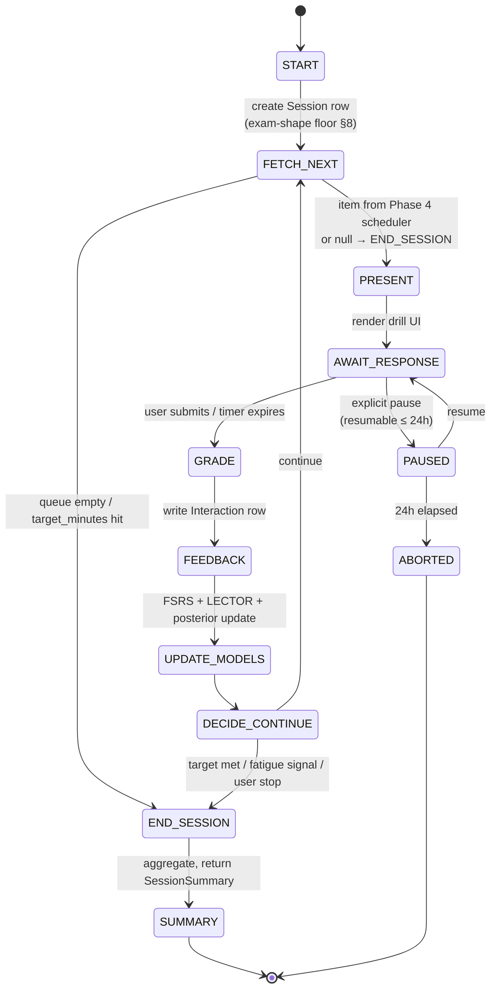
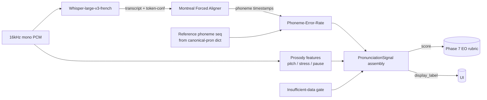

# Phase 5 — DESIGN

> Phase 5 (`05_PRACTICE_AND_DRILLS.md §2`) — the drill engines, the
> pronunciation pipeline, and the session lifecycle that turns the
> calibrated bank (Phase 3) and the learner model (Phase 4) into the
> surface a learner touches. The decisions here are mostly *operational*
> on top of contracts that already exist (`Item`, `Interaction`,
> `SessionState`, `DrillType`, `SkillPosterior`); the new contract
> additions are `PronunciationSignal` and the additive fields on
> `Interaction`. SCHEMA_VERSION bumps to `0.4.0`. Date: 2026-05-28.

---

## 0. Reading order

1. §1 invariant restatement — the things `phase5_think.md §5` says must hold.
2. §2 package layout — what lands where.
3. §3 drill loop state machine — the canonical session lifecycle.
4. §4 drill catalog — one entry per drill type, with typed I/O.
5. §5 pronunciation pipeline + `PronunciationSignal` contract.
6. §6 local-default audio + cloud opt-in seam.
7. §7 CO accessibility-alternative routing.
8. §8 exam-shape floor + planner integration.
9. §9 API surface delta.
10. §10 schema delta — additive, `SCHEMA_VERSION 0.4.0`.
11. §11 worker tasks — `score_ee`, `score_eo` wiring (rubric is Phase 7).
12. §12 EO examiner runtime — TTS + LLM follow-up.
13. §13 persistence — sessions, interactions, plan storage swap.
14. §14 error taxonomy additions.
15. §15 test plan.
16. §16 ADRs added in this phase (028–031).
17. §17 implementation order.
18. §18 out-of-scope guardrails.
19. §19 hand-off to CODE.

---

## 1. Invariants carried forward

From `phase5_think.md §5`, restated here so each section below has the
contract it must satisfy:

1. CO default drill is single-play; replay gated post-answer.
2. Accessibility-alternative drills emit a different `Interaction.module`
   and do not contribute to the substituted-skill posterior.
3. Every `PronunciationSignal` is structurally marked coarse-proxy.
4. No learner audio persisted by default; `Interaction.audio_path` is `None`.
5. No learner audio/text crosses the network by default; cloud is a
   per-deploy operator opt-in.
6. Exam-shape floor enforced at `POST /v1/session/start`.
7. Every drill produces a typed `Interaction` row consumed by Phase 4.
8. No `Item` schema change; `Interaction` extends additively; bump to `0.4.0`.
9. Drill UIs are keyboard-navigable and axe-clean.
10. Default plan satisfies the 10-min/day shadowing floor.
11. The "perfect agent" passes every drill type.

---

## 2. Package layout

```
packages/sla/src/tcf_accel_sla/
├── drills/                              # NEW
│   ├── __init__.py
│   ├── base.py                          # DrillSpec, DrillStep, DrillSession protocols
│   ├── co_mcq.py                        # core CO single-play MCQ
│   ├── co_dictation.py
│   ├── co_shadowing.py
│   ├── co_accent.py                     # accent discrimination
│   ├── co_gapfill.py
│   ├── co_lexical_alt.py                # accessibility alternative (§7)
│   ├── ce_mcq.py
│   ├── ce_skim_scan.py
│   ├── ce_vocab_context.py
│   ├── ce_register_id.py
│   ├── ce_summary.py
│   ├── ee_task.py                       # parametric on Task 1/2/3
│   ├── ee_rewrite.py
│   ├── ee_connector.py
│   ├── ee_error_correction.py
│   ├── ee_register_adjust.py
│   ├── eo_task.py                       # parametric on Task 1/2/3
│   ├── eo_picture.py
│   ├── eo_spontaneous.py
│   ├── eo_roleplay.py
│   └── eo_repair.py
├── session/                             # NEW
│   ├── __init__.py
│   ├── lifecycle.py                     # state machine; pause/resume
│   ├── exam_shape_floor.py              # the §8 gate
│   └── interaction_writer.py            # the single funnel into `interactions`
└── (scheduler / estimator / diagnostic / planner — unchanged from Phase 4)

packages/ml/src/tcf_accel_ml/             # was scaffold-only; populated here
├── __init__.py
├── asr/
│   ├── __init__.py
│   ├── whisper_fr.py                    # local Whisper-large-v3-french wrapper
│   └── backend.py                       # local / cloud-opt-in dispatch
├── alignment/
│   ├── __init__.py
│   └── mfa.py                           # Montreal Forced Aligner wrapper
├── prosody/
│   ├── __init__.py
│   ├── pitch.py                         # f0 contour via librosa
│   ├── stress.py                        # syllabic stress placement
│   └── pause.py                         # pause detection
├── pronunciation/
│   ├── __init__.py
│   ├── signal.py                        # PronunciationSignal Pydantic model
│   ├── per.py                           # phoneme error rate
│   └── insufficient_data.py             # the gate to display_label='insufficient_data'
└── tts/
    ├── __init__.py
    └── xtts.py                          # XTTS-v2 wrapper for examiner voice (§12)

apps/api/src/tcf_accel_api/routes/
├── session.py                           # implement start/next/answer/finish (was stubbed)
└── (existing routes unchanged)

apps/api/src/tcf_accel_api/
├── session_state.py                     # NEW: in-process session store; Postgres in §13
└── (existing modules unchanged)

apps/worker/src/tcf_accel_worker/tasks/
├── score_ee.py                          # NEW (rubric Phase 7; pipeline here)
├── score_eo.py                          # NEW (rubric Phase 7; pipeline here)
└── (existing tasks unchanged)
```

The `tcf_accel_sla.drills` package is pure-stdlib *for the drill logic*;
ML calls (Whisper, MFA, TTS) live behind a port that defaults to
`tcf_accel_ml` but can be stubbed for tests. This keeps the
`make verify` posture from Phase 4 — `packages/sla` has no heavy
runtime dependency.

---

## 3. Drill loop state machine



Every transition emits a structured log line `session.transition` with
`session_id`, `from`, `to`, `t` (monotonic ms), and the drill-specific
payload key. The transition log is the resume substrate: PAUSED→
AWAIT_RESPONSE on resume rehydrates from the last `PRESENT` transition
plus the in-flight item id.

### 3.1 The `DrillSession` protocol

```python
# packages/sla/src/tcf_accel_sla/drills/base.py

class DrillSpec(Protocol):
    """Static spec describing how a drill is rendered and graded."""
    drill_kind: ClassVar[DrillKind]           # see §10 for the enum
    module: ClassVar[Module]                  # CO|CE|EE|EO (the *posterior* this updates)
    requires_audio_in: ClassVar[bool]
    requires_audio_out: ClassVar[bool]
    exam_pace_default_s_per_item: ClassVar[int | None]
    accessibility_alt: ClassVar["DrillKind | None"]   # routes to lexical_alt for CO etc.

class DrillSession(Protocol):
    """One in-flight drill of a given kind."""
    spec: DrillSpec
    session_id: SessionId
    def present(self, item: Item) -> DrillStep: ...
    def grade(self, item: Item, step: DrillStep, response: dict) -> DrillResult: ...
    def to_interaction(
        self, *, user_id: UserId, item: Item, step: DrillStep, result: DrillResult,
    ) -> Interaction: ...
```

`DrillStep` carries presentation state (e.g., for shadowing, the
expected audio length). `DrillResult` carries graded outputs (`correct`,
`partial_credit`, `pronunciation_signal`, error annotations). The
`to_interaction` step is the *single funnel* into the `interactions`
table (§13); no drill writes directly.

### 3.2 The lifecycle adapter

```python
# packages/sla/src/tcf_accel_sla/session/lifecycle.py

def start(user_id, request: SessionStart) -> SessionState:
    """Create a session iff the exam-shape floor (§8) is satisfied."""

def fetch_next(session_id) -> SessionItem | None:
    """Pop the head of the per-session schedule queue (ADR-0012)."""

def submit_answer(session_id, body: SessionAnswer) -> SessionState:
    """Run the drill's grade(); write Interaction (§13); update FSRS + posterior."""

def finish(session_id) -> SessionSummary:
    """Commit deltas, regenerate plan if posterior shifted past threshold."""

def pause(session_id) -> SessionState: ...
def resume(session_id) -> SessionState: ...
```

`submit_answer` is the only path that mutates `interactions`. It is
idempotent on `(session_id, item_id)`: a duplicate POST returns the
prior `SessionState` and does not re-grade.

---

## 4. Drill catalog

One module per drill type. Each entry below names the `drill_kind`
value, the module whose posterior it updates, the typed I/O, and the
gate constants pulled out of the spec. Every drill is keyboard-only
operable and produces an `Interaction` row.

### 4.1 CO drills

#### `co_mcq` — Core: Single-play MCQ
- Module: `CO`. Posterior: yes.
- UX contract: `<audio>` rendered with `controls={false}`, custom React
  player binds only play/pause; arrow keys do not seek; `preload="none"`
  prevents a buffered cache; the audio element is replaced (not
  re-shown) after submission so that `currentTime` cannot be reset
  via DevTools.
- Exam-pace timer: `audio_length + 20 s`. Total session ceiling: 35 min.
- Grading: MCQ correctness; `partial_credit = None`.
- `Interaction.raw_response`: `{"option_id": "...", "audio_replays": 0}`.
  `audio_replays` is enforced to be 0 in default mode; non-zero only in
  review mode (which writes a *separate* `Interaction` row with
  `drill_kind="co_review"` that does *not* enter the posterior).

#### `co_dictation`
- Module: `CO`. Posterior: yes.
- Item shape: 8–12 s utterance from CO bank with ground-truth transcript.
- UX: audio plays once (single-play default applies); learner types
  transcription; submit on Enter.
- Grading: WER against ground truth. Errors classified into
  `{spelling, missing, extra, agreement, register}` by
  `dictation_error_class(alignment) -> ErrorClass[]`. The classifier
  is rule-based on the Levenshtein alignment; the *register* class is
  the only ML-flavored one and reuses the Phase 3 register classifier.
- `Interaction.raw_response`:
  `{"transcription": "...", "wer": 0.13, "error_classes": ["agreement","spelling"]}`.

#### `co_shadowing`
- Module: `CO`. Posterior: yes (via prosody contribution per §10
  schema delta — `pronunciation` field on `Interaction`).
- Item shape: 8–15 s utterance with reference audio + transcript.
- UX: reference plays once; learner re-speaks within 500 ms (a soft
  start window — late starts produce a warning but still grade).
- Grading: ASR transcribes learner; WPM ratio against source; phoneme
  alignment score → `PronunciationSignal`. WPM target band:
  `[0.85, 1.10] * source_wpm`.
- `Interaction.raw_response`: `{"learner_transcript": "...", "wpm_ratio": 0.92}`.
- `Interaction.pronunciation`: `PronunciationSignal` (§5).
- Counts toward the **10 min/day shadowing floor** (ADR-030); the
  planner's daily allocation reserves a `shadowing` block.

#### `co_accent` — Accent discrimination
- Module: `CO`. Posterior: yes.
- Item shape: two short clips (≤ 8 s each) sharing content but differing
  by accent label (`fr-FR | fr-CA | fr-BE | fr-CH | fr-AF`).
- UX: both clips play once on demand (single-play applies per clip);
  learner selects accent for each + a 1–5 difficulty rating.
- Grading: correct iff both labels match; difficulty rating is recorded
  but does not affect correctness.
- `Interaction.raw_response`: `{"labels": ["fr-CA","fr-FR"], "difficulty": 3}`.

#### `co_gapfill`
- Module: `CO`. Posterior: yes.
- Item shape: transcript with N gaps (N ∈ [3,7]); audio plays once.
- UX: gaps are `<input>` elements in reading order; tab navigation;
  submit on a final button (no per-gap submission).
- Grading: per-gap exact match (case- and accent-insensitive); item
  `correct = all gaps correct`.
- `Interaction.raw_response`:
  `{"answers": ["mais","cependant","donc"], "per_gap_correct": [true,true,false]}`.

#### `co_lexical_alt` — Accessibility alternative (per `phase5_think.md §1.1`)
- Module: **`CE`** (not CO) — does not contribute to the CO posterior.
- Item shape: same CO transcript, presented *as text*; questions phrased
  as lexical comprehension probes (vocab, idiom, register) rather than
  audio comprehension probes.
- UX: opt-in via the user's accessibility profile (§7); the drill UI
  carries a persistent banner: "This drill does not measure CO and does
  not contribute to your CO NCLC estimate."
- Grading: as `ce_mcq`.
- `Interaction.raw_response.drill_origin = "co_lexical_alt"` so the audit
  can detect it.

### 4.2 CE drills

#### `ce_mcq` — Core: Timed-passage MCQ
- Module: `CE`. Posterior: yes.
- Exam-pace timer: 60 s/item (soft); session ceiling 60 min.
- UX: passage + question + 4 options on one screen; scroll-position +
  time-to-first-answer captured in `raw_response`.

#### `ce_skim_scan`
- Module: `CE`. Posterior: yes.
- UX: passage shown for 30 s, then *replaced* by a black/empty placeholder;
  3 detail questions follow.
- Grading: per-question correctness; `correct = all three correct`.
- `Interaction.raw_response`: `{"expose_ms": 30000, "per_q_correct": [...]}`.

#### `ce_vocab_context`
- Module: `CE`. Posterior: yes (lexical sub-skill weight; see Phase 4).
- Item shape: passage with N highlighted lexemes (each its own MCQ).
- Grading: per-lexeme; aggregate `correct` rate stored.

#### `ce_register_id`
- Module: `CE`. Posterior: yes.
- Item shape: 3 register variants of the same passage; learner sorts.
- Grading: exact ordering correct.

#### `ce_summary`
- Module: `CE`. Posterior: yes (via written-output rubric — small weight).
- Item shape: passage; learner writes a 40-word summary.
- Grading: this phase ships a **stubbed** scorer (`stub_ce_summary_score`)
  that returns a fixed `coverage=0.5, fidelity=0.5, brevity=1.0` triple
  with `display_label="insufficient_calibration"`; Phase 7 swaps in the
  real rubric. The stub is structurally marked as
  `signal_kind="coarse_proxy"` so the UI cannot surface a number.

### 4.3 EE drills

EE drills all share the **strict word-count gate**:

```python
WORD_COUNT_TARGETS = {1: 60, 2: 120, 3: 180}      # Task → target words
WORD_COUNT_BAND = (0.80, 1.10)                    # acceptable share of target
def word_count_penalty(actual: int, target: int) -> int:
    """Piecewise linear: 0 inside band; -1 per 5% outside; cap at -4."""
```

#### `ee_task` — Core: 3-task timed write
- Module: `EE`. Posterior: yes (rubric-based, Phase 7).
- Parametric on `task_number ∈ {1,2,3}`. One `Item` per task; the
  session schedules either a single task or all three in sequence.
- Timer: Task 1 = 10 min, Task 2 = 20 min, Task 3 = 30 min.
- Grading: pipeline this phase, rubric Phase 7. Phase 5 emits an
  `Interaction` with `correct=None` and `graded_score={"pending": true,
  "task_number": N, "word_count": ..., "word_count_penalty": ...}`. The
  worker (`apps/worker/tasks/score_ee.py`) consumes the pending
  interaction asynchronously; on completion it back-fills
  `graded_score` and emits a `score.updated` event the API
  long-polls.
- `Interaction.raw_response`:
  `{"text": "...", "word_count": 117, "elapsed_s": 1180}`.

#### `ee_rewrite` — Sentence rewriting
- Module: `EE`. Posterior: yes (small weight).
- Item: a sentence at NCLC 7 register; target rewrite at NCLC 9.
- Grading: stubbed in Phase 5; Phase 7 plugs the calibrated rubric.

#### `ee_connector` — Connector cloze
- Module: `EE`. Posterior: yes.
- Item: passage with N connector slots; each slot is a 4-option MCQ
  drawn from the connector's *semantic category*
  (`{addition, contrast, cause, conclusion}`).
- Grading: per-slot; aggregate stored.
- The connector pool is at `packages/content/data/connectors.fr.yaml`;
  Phase 5 ships a 200-entry pool (sourced from FLELex + a hand-curated
  augmentation under `packages/content/data/connectors_supplement.yaml`).

#### `ee_error_correction`
- Module: `EE`. Posterior: yes (via revision-quality signal).
- Item shape: a *prior* `ee_task` Interaction with `error_annotations`
  attached by the Phase 7 scorer (or by the stub). Learner re-writes
  flagged sentences only.
- Grading: per-sentence accept/reject by the same scorer.
- Dependency: ships stubbed for sentences where Phase 7 has not yet
  delivered annotations; the stub emits `display_label="insufficient_data"`.

#### `ee_register_adjust`
- Module: `EE`. Posterior: yes (small weight).
- Item: familier → soutenu rewrite or vice versa.
- Grading: stubbed; Phase 7 rubric extension.

### 4.4 EO drills

EO drills all record audio. Honoring `phase5_think.md §1.3`, the
recording lives in memory; the resulting waveform's `sha256` is the
cache key and the bytes are dropped after `PronunciationSignal`
emission unless the operator opted into local-audio retention.

#### `eo_task` — Core: 3-task recorded
- Module: `EO`. Posterior: yes (rubric Phase 7).
- Parametric on task number. Task 1 ≈ 3 min, Task 2 ≈ 3.5 min,
  Task 3 ≈ 3.5 min. Task 2 has 2 min prep.
- Pipeline: record → Whisper-fr ASR → MFA alignment → prosody features
  → `PronunciationSignal` → emit `Interaction` with
  `graded_score={"pending": true}` and pronunciation field populated.
  Worker `score_eo.py` consumes and (Phase 7) scores the rubric.
- Examiner UX: TTS prompts via `tcf_accel_ml.tts.xtts`; LLM-generated
  follow-up (§12).
- `Interaction.raw_response`: `{"task_number": 1, "duration_s": 180,
  "asr_transcript": "...", "asr_mean_conf": 0.82, "examiner_prompts":
  [...], "follow_ups": [...]}`.

#### `eo_picture` — Picture description
- 30 s prep + 90 s production. Item carries 1 image + 1 prompt.

#### `eo_spontaneous` — Spontaneous opinion
- 5 s prep + 60 s production.

#### `eo_roleplay`
- Item carries a scenario + a TTS interlocutor script with 2–3 turns.
- Each turn alternates examiner-TTS / learner-record. 90 s total.

#### `eo_repair` — Repair-after-feedback
- Phase 5 ships the *shell*: a router that, given a prior EO
  `Interaction`, picks a micro-drill from
  `packages/content/data/eo_repair_microdrills.yaml`. The "which
  sub-criterion was lowest" identifier is **stubbed** to round-robin
  across `{pronunciation, lexis, grammar, discourse, register,
  interaction}` until Phase 7 swaps in the rubric scorer's identifier.

### 4.5 Drill catalog summary

| `drill_kind` | Module | Updates posterior | Records audio | Phase 7 dep |
|---|---|---|---|---|
| `co_mcq` | CO | ✅ | ❌ | — |
| `co_dictation` | CO | ✅ | ❌ | — |
| `co_shadowing` | CO | ✅ (+ pron) | ✅ | — |
| `co_accent` | CO | ✅ | ❌ | — |
| `co_gapfill` | CO | ✅ | ❌ | — |
| `co_lexical_alt` | **CE** | ✅ (CE) | ❌ | — |
| `ce_mcq` | CE | ✅ | ❌ | — |
| `ce_skim_scan` | CE | ✅ | ❌ | — |
| `ce_vocab_context` | CE | ✅ | ❌ | — |
| `ce_register_id` | CE | ✅ | ❌ | — |
| `ce_summary` | CE | ✅ (small) | ❌ | rubric |
| `ee_task` | EE | ✅ | ❌ | rubric |
| `ee_rewrite` | EE | ✅ (small) | ❌ | rubric |
| `ee_connector` | EE | ✅ | ❌ | — |
| `ee_error_correction` | EE | ✅ (small) | ❌ | annotations |
| `ee_register_adjust` | EE | ✅ (small) | ❌ | rubric |
| `eo_task` | EO | ✅ (+ pron) | ✅ | rubric |
| `eo_picture` | EO | ✅ | ✅ | rubric |
| `eo_spontaneous` | EO | ✅ | ✅ | rubric |
| `eo_roleplay` | EO | ✅ | ✅ | rubric |
| `eo_repair` | EO | ✅ | ✅ | rubric + identifier |

---

## 5. Pronunciation pipeline + `PronunciationSignal` contract

### 5.1 The pipeline



Each step is implemented under `packages/ml/src/tcf_accel_ml/`:

| Step | Module | Notes |
|---|---|---|
| ASR | `asr/whisper_fr.py` | `bofenghuang/whisper-large-v3-french`; CPU-only default; chunked 30s windows; returns transcript + per-token confidence |
| Alignment | `alignment/mfa.py` | Montreal Forced Aligner with the `french_mfa` acoustic + dictionary; subprocess wrapper (MFA is a separate binary); idempotent on `sha256(audio)` |
| PER | `pronunciation/per.py` | Levenshtein over phoneme sequences; canonical pron dict at `packages/ml/data/pron_dict_fr.tsv` (LeFFF + Lexique 3.83) |
| Prosody | `prosody/pitch.py`, `stress.py`, `pause.py` | librosa f0; rule-based stress placement against syllabified reference; pause threshold = 200 ms silence |
| Assembly | `pronunciation/signal.py` | Builds `PronunciationSignal` per §5.2; runs the insufficient-data gate |

### 5.2 The `PronunciationSignal` contract

```python
# packages/ml/src/tcf_accel_ml/pronunciation/signal.py

class PronunciationSignal(BaseModel):
    """Coarse-proxy pronunciation signal.

    See ADR-031 and `phase5_think.md §1.2`. The UI consumes
    `display_label`; the rubric scorer consumes `score`. Direct access
    to `score` outside `packages/sla.scoring` and
    `apps/worker.tasks.score_*` is lint-blocked.
    """
    model_config = ConfigDict(extra="forbid", frozen=True)

    score: float = Field(ge=0.0, le=1.0)
    signal_kind: Literal["coarse_proxy"] = "coarse_proxy"
    disclaimer_version: str = Field(min_length=1)         # e.g. "v1.0"
    display_label: Literal["weak","fair","strong","insufficient_data"]

    per: float = Field(ge=0.0, description="Phoneme-error-rate.")
    asr_mean_confidence: float = Field(ge=0.0, le=1.0)
    n_phonemes_aligned: int = Field(ge=0)
    duration_s: float = Field(ge=0.0)
    prosody: PronunciationProsody                        # nested

    @model_validator(mode="after")
    def _require_disclaimer(self) -> "PronunciationSignal":
        if not self.disclaimer_version:
            raise ValueError("disclaimer_version required")
        return self

class PronunciationProsody(BaseModel):
    model_config = ConfigDict(extra="forbid", frozen=True)
    pitch_range_hz: float
    speech_rate_wpm: float
    pause_count: int
    mean_pause_ms: float
```

#### Score → `display_label` mapping

```python
def display_label_from(per: float, asr_conf: float, dur_s: float, n_phon: int) -> Label:
    if dur_s < 2.0 or asr_conf < 0.50 or n_phon < 8:
        return "insufficient_data"
    if per < 0.10: return "strong"
    if per < 0.20: return "fair"
    return "weak"
```

The thresholds are tunable per release; the **structural** properties
that are not tunable: the `display_label` *exists*, the `score` is not
the renderable field, and `signal_kind="coarse_proxy"` is fixed.

#### Lint rule

A `ruff` custom rule (`tools/lint/no_raw_pron_score.py`) flags
`.score` access on `PronunciationSignal` outside the two allowed
modules. CI enforces.

### 5.3 Insufficient-data gate consequences

When `display_label == "insufficient_data"`:

- The score does **not** contribute to the EO posterior update.
- The drill's `correct` field is set per the drill's other grading
  signal (e.g., shadowing WPM band match); pronunciation is silently
  absent.
- The audit (`tests/property/test_pronunciation_safety.py`) asserts
  this invariant on 1000 short-utterance synthetic samples.

---

## 6. Local-default audio + cloud opt-in seam

### 6.1 Backend dispatch

```python
# packages/ml/src/tcf_accel_ml/asr/backend.py

class ASRBackend(Protocol):
    name: ClassVar[str]
    def transcribe(self, audio: bytes, *, sample_rate_hz: int) -> ASRResult: ...

class LocalWhisperBackend(ASRBackend):
    """Default. CPU-only Whisper-large-v3-french."""
    name = "local"

class CloudLiteLLMBackend(ASRBackend):
    """Opt-in. Routes through the ADR-009 LiteLLM gateway."""
    name = "cloud:litellm"

def get_asr_backend() -> ASRBackend:
    """Reads TCF_ACCEL_ASR_BACKEND env var. Defaults to local."""
```

Similarly `tcf_accel_ml.llm.backend` (already exists per Phase 3
LiteLLM gateway) gates EE feedback model calls — local stub or cloud
LLM, env-driven.

### 6.2 Startup banner

`apps/api` and `apps/worker` print a single banner at startup:

```
tcf-accel privacy posture:
  ASR backend:  local       (Whisper-large-v3-french, CPU)
  LLM backend:  local-stub  (EE feedback runs offline)
  Audio bytes:  not persisted (Interaction.audio_path=None)
  → To enable cloud ASR or cloud LLM, see docs/ops/cloud-opt-in.md.
```

When cloud is enabled, the line changes to bold/red color (TTY only)
and reads:

```
  ASR backend:  cloud:litellm  ← LEARNER AUDIO LEAVES THE MACHINE
```

The banner is generated by `apps/api/src/tcf_accel_api/banner.py` and
printed once on the FastAPI `lifespan` startup event.

### 6.3 CI capability test

`tests/capability/test_no_network_in_default.py`:

```python
def test_default_asr_path_makes_no_network_calls(monkeypatch, blocknet):
    """blocknet is a fixture that monkeypatches socket.connect to raise.
    The local Whisper path must not hit the network."""
    monkeypatch.delenv("TCF_ACCEL_ASR_BACKEND", raising=False)
    sig = run_pronunciation_pipeline(SAMPLE_WAV)
    assert isinstance(sig, PronunciationSignal)
```

A second test asserts that `CloudLiteLLMBackend` is only constructed
when the env var is set to `cloud:litellm`; constructing it under any
other value raises.

### 6.4 What about model weight downloads?

A first-time install of Whisper-large-v3-french requires fetching ~3 GB
of weights from Hugging Face. This is *not* an inference-time network
call; it is an install-time one, and it is one-shot per machine. We
treat it as part of `make install-models` (an explicit operator step),
not as part of the inference path. The capability test above is on the
*inference* path; weight downloads are tested separately and run only
in CI's setup phase.

---

## 7. CO accessibility-alternative routing

### 7.1 The user profile

```python
# tcf_accel.schemas.api.me (extension)

class AccessibilityProfile(BaseModel):
    model_config = ConfigDict(extra="forbid")
    co_alternative: Literal["none", "lexical_alt"] = "none"
    ee_alternative: Literal["none", "speech_to_text"] = "none"
    eo_alternative: Literal["none", "text_input"] = "none"
    high_contrast: bool = False
    dyslexia_font: bool = False
```

The profile is owned by `GET/PATCH /v1/me/accessibility`. It is
local-only per ADR-017.

### 7.2 Drill routing

When `accessibility_profile.co_alternative == "lexical_alt"` and the
planner emits a CO block, the session-start path swaps the
`drill_kind` from any CO variant to `co_lexical_alt`. The drill
catalog declares this mapping explicitly:

```python
ACCESSIBILITY_DRILL_MAP = {
    ("CO", "lexical_alt"): "co_lexical_alt",
    ("EE", "speech_to_text"): "ee_task",        # STT plugs at the input layer
    ("EO", "text_input"): "eo_text_alt",        # produces module=EE, banner-disclaimed
}
```

The swap is performed in `tcf_accel_sla.session.lifecycle.start`
*before* the exam-shape floor check; the floor counts
`co_lexical_alt` time as CE-shape, not as CO-shape.

### 7.3 The banner contract

Every accessibility-alternative drill renders a persistent banner via
the existing `<Banner>` component (Phase 8 ships the styling; Phase 5
ships the text). Banner text lives in
`packages/content/data/a11y_banners.fr.yaml` and
`a11y_banners.en.yaml`:

```yaml
co_lexical_alt:
  fr: |
    Ce mode ne mesure pas la compréhension orale et ne contribue pas
    à votre estimation NCLC en CO.
  en: |
    This drill does not measure CO and does not contribute to your
    CO NCLC estimate. See [accommodations] for the official process.
```

### 7.4 The audit

`tests/property/test_a11y_alt_routing.py` asserts:

```python
@given(interactions=lists(interaction_strategy(), min_size=1))
def test_lexical_alt_never_writes_co_module(interactions):
    for i in interactions:
        if i.raw_response.get("drill_origin") == "co_lexical_alt":
            assert i.module == "CE"
```

---

## 8. Exam-shape floor + planner integration

### 8.1 The check

```python
# packages/sla/src/tcf_accel_sla/session/exam_shape_floor.py

EXAM_SHAPE_FLOOR_MIN = 30          # rolling 7-day minimum, minutes
EXAM_SHAPE_FLOOR_LOWER = 20        # cannot configure below this
EXAM_SHAPE_DRILL_KINDS = {"mock_section", "eo_task", "ee_task"}  # see §10 below

def floor_satisfied(user_id, *, now: datetime, dismissal_log) -> bool:
    minutes = rolling_7d_exam_shape_minutes(user_id, now=now)
    if minutes >= EXAM_SHAPE_FLOOR_MIN:
        return True
    return dismissed_this_week(dismissal_log, now=now)
```

### 8.2 The API integration

`POST /v1/session/start` checks the floor *before* allocating the
session row. If the floor is violated and not dismissed:

```http
HTTP/1.1 409 Conflict
Content-Type: application/json

{
  "error": "E_SESSION_001",
  "message": "Exam-shape floor not met this week.",
  "details": {
    "rolling_7d_exam_shape_minutes": 0,
    "floor": 30,
    "next_action": "exam_shape",
    "suggested_drill_kinds": ["mock_section","ee_task"],
    "dismissable": true,
    "dismissal_phrase_required": null
  }
}
```

The frontend (Phase 8) renders this as a modal with two buttons:
"Start an exam-shape session" (the recommended path) and "Dismiss this
week" (records to the dismissal log).

### 8.3 The dismissal mechanism

```python
# packages/sla/src/tcf_accel_sla/session/exam_shape_floor.py

class DismissalLogEntry(BaseModel):
    user_id: UserId
    dismissed_at: datetime
    week_iso: str                  # e.g., "2026-W22"
    reason: str | None = None

def record_dismissal(user_id, *, now, reason=None) -> DismissalLogEntry: ...
def dismissed_this_week(log, *, now) -> bool: ...
```

Storage: local-only JSONL at `data/dismissal_log.jsonl` (gitignored;
see Phase 1 I5). 90-day retention; the daily Celery housekeeper
truncates entries older than 90 days.

A separate counter tracks chronic dismissals: `audit-exam-shape`
(invoked by the operator) reports any user with ≥ 4 dismissals in the
past 8 weeks. The doctrine remains; the audit flags the divergence.

### 8.4 Planner integration

The planner (Phase 4 `generate_plan`) gains a new soft constraint: on
days where `rolling_7d_exam_shape_minutes` projected forward would
fall below the floor, the day's first block is forced to an
exam-shape `drill_kind`. The forcing happens in
`generate_plan._enforce_exam_shape_cadence(plan)` as a post-pass.

The 80/20 ratio is a *soft* signal in the same pass: the rationale
string includes "+ exam-shape cadence" when the cadence pass touched
the day. The hard component (the §8.1 check) is the gate; the soft
component is the nudge.

---

## 9. API surface delta

### 9.1 Session routes (implemented)

| Route | Method | Status | Handler |
|---|---|---|---|
| `/v1/session/start` | POST | implement | `routes/session.py::start` |
| `/v1/session/{id}/next` | GET | implement | `routes/session.py::next_item` |
| `/v1/session/{id}/answer` | POST | implement | `routes/session.py::answer` |
| `/v1/session/{id}/finish` | POST | implement | `routes/session.py::finish` |
| `/v1/session/{id}/pause` | POST | **new** | `routes/session.py::pause` |
| `/v1/session/{id}/resume` | POST | **new** | `routes/session.py::resume` |

`pause` returns the current `SessionState` with `finished_at=None` and
a `paused_at` field added. `resume` validates `now - paused_at <= 24h`
and returns the same `SessionState` shape, or `410 Gone` if the pause
window expired.

### 9.2 New routes

| Route | Method | Purpose |
|---|---|---|
| `/v1/me/accessibility` | GET / PATCH | Accessibility profile (§7) |
| `/v1/session/exam-shape/dismiss` | POST | Dismiss this week's floor |
| `/v1/insights/exam-shape` | GET | Rolling 7-day stats + dismissal log summary |
| `/v1/pronunciation/disclaimer` | GET | Returns current disclaimer version + copy |

### 9.3 Schema delta on existing routes

- `SessionStart.drill_type` accepts new values; see §10.
- `SessionItem` gains `accessibility_banner_key: str | None` for the
  banner-text key the frontend looks up.
- `SessionSummary.deltas` is unchanged; production-skill rubric updates
  arrive asynchronously via `/v1/insights/readiness` (existing).

### 9.4 Error responses

The new error codes (§14):

- `E_SESSION_001` — exam-shape floor not met (409).
- `E_SESSION_002` — pause window expired (410).
- `E_SESSION_003` — accessibility profile required for requested drill (409).
- `E_ASR_001` — ASR backend unavailable (503).
- `E_PRON_001` — pronunciation pipeline failure; signal will be missing (returns 200 with `pronunciation=null` plus a structured warning).

---

## 10. Schema delta — `SCHEMA_VERSION = "0.4.0"`

Additive only. No removals; no required-field bumps on existing types.

### 10.1 `Interaction` extensions

```python
# packages/shared/src/tcf_accel/schemas/interaction.py

class Interaction(BaseModel):
    # ... existing fields ...
    drill_kind: DrillKind | None = Field(
        default=None,
        description="The specific drill that produced this row. Phase 5+.",
    )
    pronunciation: "PronunciationSignal | None" = Field(
        default=None,
        description="Set for drills that record audio; coarse-proxy signal (ADR-031).",
    )
    audio_path: str | None = Field(
        default=None,
        description="Local-only relative path under data/ if operator opted into retention. Else None.",
    )
```

`drill_kind` is a `Literal[...]` of the 21 values in §4.5, plus a
catch-all `"mock_section"` and `"diagnostic_item"`. The set is
extensible across phases via additive bumps.

### 10.2 `DrillType` literal (existing) — additive extension

`packages/shared/src/tcf_accel/schemas/api/plan.py` currently lists 9
values. Phase 5 adds the missing drill kinds as additional literals
*on the same `DrillType`*:

```python
DrillType = Literal[
    # Phase 1–4 (kept):
    "flashcard", "cloze", "mcq", "shadowing", "writing_short",
    "writing_long", "speaking_role", "speaking_mono", "mock_section",
    # Phase 5 additions:
    "co_dictation", "co_accent", "co_gapfill", "co_lexical_alt",
    "ce_skim_scan", "ce_vocab_context", "ce_register_id", "ce_summary",
    "ee_rewrite", "ee_connector", "ee_error_correction", "ee_register_adjust",
    "eo_picture", "eo_spontaneous", "eo_roleplay", "eo_repair",
    "eo_text_alt",
]
```

The Phase 1–4 names map to drill kinds as follows:

- `mcq` → `co_mcq` or `ce_mcq` (planner emits with module discriminator).
- `shadowing` → `co_shadowing`.
- `writing_short` → `ee_task` task 1.
- `writing_long` → `ee_task` task 3.
- `speaking_mono` → `eo_task` task 2 or 3.
- `speaking_role` → `eo_roleplay`.
- `cloze` → `ee_connector` or a CE cloze variant; planner emits the
  finer kind into `Interaction.drill_kind`.
- `flashcard` → out-of-Phase-5 (vocab review path; remains unimplemented).
- `mock_section` → Phase 6.

This kept-name mapping is documented in
`packages/shared/src/tcf_accel/schemas/api/plan.py` docstring; a
property test asserts the legacy names are never *removed*.

### 10.3 New types

- `PronunciationSignal`, `PronunciationProsody` — §5.2.
- `AccessibilityProfile` — §7.1.
- `DismissalLogEntry` — §8.3.
- `DrillKind` — re-export of the §10.1 literal.

### 10.4 Round-trip test extension

`packages/shared/tests/test_roundtrip.py` is extended with a fixture
for every new schema; round-trip via `model_dump_json()` →
`model_validate_json()` must be identity.

---

## 11. Worker tasks — `score_ee` and `score_eo` (pipeline-only)

Phase 7 implements the rubric scoring. Phase 5 wires the *pipeline*
that delivers the scored input to Phase 7. The worker task shape:

```python
# apps/worker/src/tcf_accel_worker/tasks/score_ee.py

@celery_app.task(bind=True, name="score_ee", autoretry_for=(TransientError,))
def score_ee(self, interaction_id: int) -> None:
    """Phase 5: assemble the scoring payload; Phase 7: actually score.

    Pipeline:
      1. Load the Interaction; assert pending.
      2. Run language-tool-fr / grammar checks; emit error annotations.
      3. Compute lexical diversity + connector density.
      4. Phase 7 hook: rubric_scorer.score_ee(payload) → WritingRubric.
         Phase 5 stub: returns rubric with display_label='insufficient_calibration'.
      5. Update Interaction.graded_score; emit score.updated event.
    """
```

Same shape for `score_eo`:

```python
@celery_app.task(bind=True, name="score_eo", autoretry_for=(TransientError,))
def score_eo(self, interaction_id: int) -> None:
    """1. Load Interaction; 2. Re-run pronunciation pipeline if missing;
    3. Phase 7 hook → SpeakingRubric; Phase 5 stub; 4. Update; 5. Event."""
```

Both tasks are idempotent on `interaction_id`. The Phase 7 hook is a
plain function dispatched through a registry; Phase 7 will register
the real scorer at import time and remove the stub.

---

## 12. EO examiner runtime — TTS + LLM follow-up

### 12.1 TTS

`tcf_accel_ml.tts.xtts` wraps Coqui XTTS-v2 with a fixed
examiner-style voice cloned from a CC-BY recording in
`packages/content/data/voices/examiner.wav` (license recorded). SSML-
lite prosody hints (pause, emphasis) are emitted from
`prompts/eo_examiner.j2` per task.

Voice rendering is **local-only** (XTTS-v2 runs on CPU at ~3× real-time
on the documented baseline). There is no cloud TTS opt-in in Phase 5;
the operator who wants cloud TTS is on their own.

Output audio is cached at `data/cache/tts/<sha256(text+voice_id)>.wav`
(gitignored). The cache key is content-hashed so re-runs are free.

### 12.2 LLM follow-up

After the learner records Task 1 (Q&A) or Task 3 (defense), the
transcript is passed to the LiteLLM gateway with the
`prompts/eo_followup.j2` template. The template constrains output to:

```
{"follow_up_prompts": ["...","..."], "rationale": "..."}
```

Up to 2 follow-ups per task. The gateway respects the operator's
`TCF_ACCEL_LLM_BACKEND` env var (local stub or cloud LiteLLM); the
local stub returns a fixed pool of follow-ups keyed by task and topic.

The fixed-pool stub is *not* a quality regression for Phase 5
acceptance: the audit (`tests/eo/test_followup_diversity.py`) accepts
the stub iff at least 8 distinct follow-ups exist per task; the cloud
LLM produces more variety in deployment.

---

## 13. Persistence — sessions, interactions, plan storage

### 13.1 Sessions table

Phase 2 schema (ADR-0011) reserved a `sessions` table. Phase 5 lights
it up:

```sql
CREATE TABLE sessions (
  id UUID PRIMARY KEY,
  user_id UUID NOT NULL REFERENCES users(id),
  module module_enum NOT NULL,
  drill_type drill_type_enum NOT NULL,
  target_minutes INT NOT NULL CHECK (target_minutes BETWEEN 1 AND 240),
  started_at TIMESTAMPTZ NOT NULL,
  finished_at TIMESTAMPTZ,
  paused_at TIMESTAMPTZ,
  items_seen INT NOT NULL DEFAULT 0,
  items_correct INT NOT NULL DEFAULT 0,
  exam_shape BOOLEAN NOT NULL DEFAULT FALSE,
  created_at TIMESTAMPTZ NOT NULL DEFAULT now()
);
CREATE INDEX ix_sessions_user_started ON sessions(user_id, started_at DESC);
```

Migration: `infra/migrations/versions/0003_phase5_sessions_alter.py`.
(The `sessions` table itself was created in `0001_initial.py`; Phase 5
*alters* it to add `paused_at`, `items_seen`, `items_correct`, and
`exam_shape`. The next free revision after `0002_confusable_pairs` is
`0003` — Phase 4 shipped no migrations, having used in-process state.)

The `exam_shape BOOLEAN` lets the rolling-7d query (§8) be cheap:
`SELECT SUM(...) FROM sessions WHERE user_id=$1 AND exam_shape AND
finished_at > now() - interval '7 days'`.

### 13.2 Interactions table

The Phase 2 schema's `interactions` table gains the new columns from
§10.1:

```sql
ALTER TABLE interactions
  ADD COLUMN drill_kind drill_kind_enum,
  ADD COLUMN pronunciation_signal JSONB,
  ADD COLUMN audio_path TEXT;
```

Migration: `infra/migrations/versions/0004_phase5_interactions_alter.py`.

`pronunciation_signal` is JSONB carrying the `PronunciationSignal`
shape. We do **not** index into the JSONB; the rubric scorer reads the
whole blob. A future Phase 9 audit may add a generated column.

### 13.3 Plan persistence

Phase 4 used an in-process dict (`apps/api/src/tcf_accel_api/state.py`).
Phase 5 swaps to Postgres via the Phase 2 `study_plans` table.
`generate_plan` becomes write-through:

```python
def save_plan(plan: StudyPlanView, *, db: Session) -> None:
    """INSERT … ON CONFLICT (user_id, generated_at) DO NOTHING."""
```

The in-process state in `state.py` is removed; `UserState.posteriors`
moves into a `user_posteriors` table (Phase 2 schema). `UserState`
itself is deleted as a class; per-request handlers fetch what they
need.

### 13.4 Dismissal log

Local JSONL at `data/dismissal_log.jsonl`. Not in Postgres because
ADR-017 / privacy-default-local-only — the dismissal log is a
per-operator record of learner deviations from doctrine; it does not
need to be query-rich.

---

## 14. Error taxonomy additions

Phase 5 adds these to the `tcf_accel.errors` envelope (Phase 1
ADR-014):

| Code | HTTP | Meaning |
|---|---|---|
| `E_SESSION_001` | 409 | Exam-shape floor not met; dismissable. |
| `E_SESSION_002` | 410 | Pause window > 24h expired. |
| `E_SESSION_003` | 409 | Requested drill needs an accessibility-profile setting. |
| `E_SESSION_004` | 422 | Drill-specific input invalid (e.g., empty EE text). |
| `E_ASR_001` | 503 | ASR backend unavailable (local model failed to load). |
| `E_PRON_001` | 200 | Pronunciation pipeline produced no signal; response carries `pronunciation=null`. (Soft error; warning.) |
| `E_TTS_001` | 503 | TTS backend unavailable. |
| `E_LLM_001` | 503 | LLM gateway unavailable (only seen if operator opted into cloud LLM). |

All carry the Phase 1 `ErrorEnvelope` shape: `{error, message,
details, request_id}`.

---

## 15. Test plan

### 15.1 Unit tests

| Path | Coverage |
|---|---|
| `packages/sla/tests/drills/test_co_mcq.py` | Single-play UX enforced; replay-blocked path; correct grading |
| `packages/sla/tests/drills/test_co_shadowing.py` | WPM ratio computation; pronunciation field populated; sub-2s utterance → `insufficient_data` |
| `packages/sla/tests/drills/test_co_dictation.py` | WER computation; error classification; agreement-class smoke |
| `packages/sla/tests/drills/test_co_gapfill.py` | Per-gap exact match; accent-insensitivity |
| `packages/sla/tests/drills/test_co_accent.py` | Two-label correctness |
| `packages/sla/tests/drills/test_co_lexical_alt.py` | Emits `module=CE`; banner key set; never sets `module=CO` |
| `packages/sla/tests/drills/test_ce_*.py` | One per CE drill |
| `packages/sla/tests/drills/test_ee_*.py` | One per EE drill; word-count penalty |
| `packages/sla/tests/drills/test_eo_*.py` | One per EO drill; audio cache hit/miss |
| `packages/sla/tests/session/test_lifecycle.py` | State machine transitions; pause/resume; 24h expiry |
| `packages/sla/tests/session/test_exam_shape_floor.py` | Floor computation; dismissal path; chronic-dismissal audit |
| `packages/ml/tests/asr/test_whisper_fr.py` | Mocked Whisper output; confidence threshold |
| `packages/ml/tests/alignment/test_mfa.py` | MFA subprocess mocked; phoneme timestamp parse |
| `packages/ml/tests/pronunciation/test_signal.py` | PER computation; `display_label` mapping; structural contract |
| `packages/ml/tests/pronunciation/test_insufficient_data.py` | Every short/quiet/missing-ref path → `insufficient_data` |
| `packages/ml/tests/tts/test_xtts.py` | Cache key; idempotency |

### 15.2 Property tests

| Path | Property |
|---|---|
| `tests/property/test_drill_interaction_invariants.py` | For every drill kind, the emitted `Interaction` validates against `Interaction.model_validate` and the `module` matches the drill's declared module |
| `tests/property/test_a11y_alt_routing.py` | `co_lexical_alt` rows always have `module=CE` |
| `tests/property/test_pronunciation_safety.py` | `display_label='insufficient_data'` ⇒ posterior unchanged |
| `tests/property/test_pron_signal_contract.py` | Cannot construct a `PronunciationSignal` without `disclaimer_version`; UI-allowed field set is exactly `{display_label, signal_kind, disclaimer_version, prosody}` (the lint rule's runtime mirror) |
| `tests/property/test_exam_shape_floor.py` | If `rolling_7d_exam_shape_minutes < floor` and not dismissed, `POST /v1/session/start` for a non-exam-shape drill returns 409 |
| `tests/property/test_audio_not_persisted_default.py` | After a default-mode EO session, `data/` size delta is 0 bytes; `Interaction.audio_path is None` |

### 15.3 Capability tests

| Path | Capability |
|---|---|
| `tests/capability/test_no_network_in_default.py` | Default ASR / LLM paths produce no socket connections |
| `tests/capability/test_cloud_backend_requires_env.py` | Cloud backends refuse to construct without the explicit env var |
| `tests/capability/test_no_data_commits.py` | (existing Phase 1 hook re-asserted in CI) |

### 15.4 Pacing tests

`tests/perf/test_co_timer.py`: drives the CO exam-pace timer through a
35-min stretch (mocked clock) and asserts the per-item timer + the
session ceiling are within ±1 s of `35 min / 39 items + per-audio
overhead` cumulative.

### 15.5 ASR / MFA quality tests

`tests/quality/test_whisper_wer.py`: on a held-out 50-utterance Common
Voice fr slice, the local Whisper-large-v3-french WER ≤ 9% (matches
published benchmark; spec §4).

`tests/quality/test_mfa_per.py`: on a 50-utterance hand-aligned set
under `packages/ml/data/eval/aligned_50/`, the PER produced by our
MFA wrapper is within ±0.05 of the hand-labeled PER (spec §4).

Both quality tests are CI-gated; they require the model weights to be
present and are skipped (with a warning) if `make install-models` has
not run. This avoids a 3 GB CI download on every PR.

### 15.6 Accessibility tests

`tests/a11y/test_axe_per_drill.py`: spins up a stub HTML for every
drill UI and runs `axe-core` via playwright; zero violations required
(spec §4).

`tests/a11y/test_keyboard_walkthrough.py`: scripted keyboard walks
through each drill; every interactive element reachable; no element
trap.

### 15.7 Perfect-agent tests

`tests/pedagogy/test_perfect_agent_per_drill.py`: for each drill kind,
a scripted agent that always answers correctly produces a session
report with 100% accuracy, the expected FSRS state shift, and the
expected posterior shift (asserted to within 0.05 NCLC). This is the
spec §4 first-bullet correctness gate.

### 15.8 Drill-diversity audit

`tests/pedagogy/test_drill_diversity.py`: a 100-session synthetic run
asserts the planner selects ≥ 4 drill kinds per module. The selection
is a Phase 4 / Phase 5 boundary — Phase 4's allocator chooses
*minutes*; Phase 5's `select_drill_kind(module, posteriors, history)`
chooses *kind*.

---

## 16. ADRs added in Phase 5

### ADR-028 — 80/20 drill / exam-shape split, hard floor + soft cadence

**Status:** Accepted, 2026-05-28.
**Context:** `phase5_think.md §1.4`.
**Decision:** Enforce `rolling_7d_exam_shape_minutes >=
EXAM_SHAPE_FLOOR_MIN` as a hard gate at `POST /v1/session/start`;
nudge the 80/20 split via `generate_plan` rationale and dashboard
copy.
**Consequences:** A learner cannot have a zero-exam-shape week without
an explicit dismissal; the dismissal is logged locally; the audit
flags chronic dismissals.

### ADR-029 — CO single-play default; accessibility lexical alternative emits `module=CE`

**Status:** Accepted, 2026-05-28.
**Context:** `phase5_think.md §1.1`.
**Decision:** CO drills default to single-play (UI contract in §4.1);
the Deaf/HoH accessibility alternative emits
`drill_kind="co_lexical_alt"` with `module=CE` and does not contribute
to the CO posterior. The UX banner is mandatory.
**Consequences:** The CO posterior remains a CO measurement. Deaf/HoH
learners are routed to an honestly-labeled alternative; immigration
accommodations are linked, not implied.

### ADR-030 — Mandatory 10 min/day shadowing in default plans

**Status:** Accepted, 2026-05-28.
**Context:** Spec §1.4, §2.2; master prompt §2.1.6.
**Decision:** `generate_plan` reserves a 10-min `co_shadowing` block
in every daily allocation by default; a learner can reduce it (≥ 3 min
floor) but not eliminate it without an operator-level plan-template
change.
**Consequences:** Prosody-acquisition pressure is structural, not
optional. Audit asserts the default plan satisfies the floor across
100 synthetic cohorts.

### ADR-031 — `PronunciationSignal` structural coarse-proxy contract

**Status:** Accepted, 2026-05-28.
**Context:** `phase5_think.md §1.2`; R-004-shape harm.
**Decision:** `PronunciationSignal` ships with `score`, `signal_kind=
"coarse_proxy"`, `disclaimer_version`, `display_label`; UI consumes
`display_label`; ruff custom rule disallows `.score` access outside
the rubric and the planner.
**Consequences:** A future contributor cannot reify the pronunciation
score as evaluative without deleting an explicit lint rule and a
serializer guard.

(ADR text expanded in `docs/adrs/0028..0031`; the above is a
deliberate summary.)

---

## 17. Implementation order

The order minimizes rework. Each step ends at a working `make verify`.

1. **Schema delta (§10).** Bump `SCHEMA_VERSION` to `0.4.0`. Extend
   `Interaction`, add `DrillKind`, add `PronunciationSignal`. Add
   migrations `0003_phase5_sessions_alter`,
   `0004_phase5_interactions_alter` (both ALTER existing tables — the
   tables were created in `0001_initial`). All round-trip tests pass.
2. **`tcf_accel_sla.drills.base`.** The protocols. Then `co_mcq` and
   `ce_mcq` as the simplest drills, including the perfect-agent test
   for each. This proves the lifecycle adapter wires correctly.
3. **`tcf_accel_sla.session.lifecycle`.** State machine, pause/resume.
   Drives the existing `routes/session.py` stubs to working
   implementations. End-to-end: a learner can start an MCQ session,
   answer, finish, get a `SessionSummary`.
4. **`tcf_accel_sla.session.exam_shape_floor` + ADR-028 wiring.**
   The §8 logic. The 409 path is tested. `/v1/session/exam-shape/dismiss`
   and the dismissal log land here.
5. **All remaining CO drills, then CE.** Each lands with its unit test
   and its perfect-agent test. `co_lexical_alt` lands with the §7
   routing and the property test (ADR-029).
6. **ML stack — Whisper, MFA, prosody.** Land `packages/ml` with mocked
   tests first; the quality tests (15.5) are gated on
   `make install-models`. The cloud-opt-in env-var seam and the
   capability tests (15.3) land here.
7. **`PronunciationSignal` + lint rule + ADR-031.** `signal.py`,
   `display_label_from`, the ruff custom rule, the property tests.
8. **EE drills.** `ee_task` first (it has the strict word-count gate);
   the rest follow. `apps/worker/tasks/score_ee.py` lands with the
   Phase 7-hook stub.
9. **TTS + EO drills.** `tts/xtts.py`, then `eo_task` (uses TTS for
   prompts), then the supplementary EO drills. `score_eo.py` lands.
10. **Planner integration.** `generate_plan._enforce_exam_shape_cadence`
    + the shadowing reservation (ADR-030). The drill-diversity audit
    (15.8) passes.
11. **Persistence swap.** Move `UserState.posteriors` into Postgres.
    Remove the in-process registry. Plan persistence becomes
    write-through.
12. **Accessibility tests + perf tests.** axe-core, keyboard walks,
    the 35-min CO timer test.
13. **The capability test on the network seam.** §15.3. The single
    most important non-functional test in Phase 5.
14. **Quality gates.** WER ≤ 9%, PER within ±0.05, perfect-agent
    100%, drill diversity ≥ 4 kinds/module.
15. **Hand-off to Phase 6.** Phase 6 owns `mock_section`; its
    pre-Phase-5 stub already exists.

The order is also the audit's check order: phase 5 acceptance walks
the same numbered list.

---

## 18. Out-of-scope guardrails

Restated from `phase5_think.md §4`, sharpened for the design surface:

- **No `Item` schema change.** The CO transcript field, the EE prompt
  shape, the EO examiner script — all defined by Phase 3.
- **No new wire endpoints for production scoring.** The rubric is
  Phase 7; Phase 5 ships the *pipeline* and the *stub*.
- **No `pgvector` writes from Phase 5 paths.** Confusable-pair lookups
  remain a Phase 4 LECTOR-via-embedding-vectors concern.
- **No cloud TTS opt-in.** The deferred risk is small (XTTS-v2 is
  good enough); the deferral keeps the privacy seam to one place.
- **No per-user FSRS optimization.** ADR-023 still defers.
- **No frontend polish.** Phase 5 ships drill *stubs* sufficient for
  keyboard / a11y audit; Phase 8 owns the production UI.

The CI guard rails added in Phase 5 enforce these in code:

- `tests/property/test_phase_boundaries.py` asserts (a) no `pgvector`
  call originates in `packages/sla/drills` or `packages/ml`, (b) no
  HTTP call to `*.france-education-international.fr` occurs at runtime
  (FEI is link-only per ADR-020), (c) `packages/ml/tts` exposes only
  local backends.

---

## 19. Hand-off to CODE

Phase 5 code ships in the implementation order of §17. The
deliverable list:

- New Pydantic types (§5.2, §7.1, §8.3, §10.1).
- 21 drill modules under `packages/sla/src/tcf_accel_sla/drills/`.
- The lifecycle + exam-shape-floor modules.
- The ML stack under `packages/ml/src/tcf_accel_ml/`.
- The `routes/session.py` implementation + the 3 new routes (§9.2).
- The two worker tasks (`score_ee.py`, `score_eo.py`) with
  Phase 7-hook registry.
- The two Alembic migrations.
- The 4 ADR documents (`docs/adrs/0028..0031.md`).
- The test suite (§15).
- The startup banner (§6.2).
- The ruff custom rule (§5.2) + its test.

The audit doc (`phase5_audit.md`) walks the §17 order and reports
pass/fail per step. The evaluate doc (`phase5_evaluate.md`) restates
the acceptance + anti-criteria from spec §5 and lists the audit's
verdict per item.

Phase 5's hand-off to Phase 6 is the `mock_section` drill kind: Phase 5
reserves the name in `DrillType`, ships no implementation, and
documents the contract Phase 6 fills in. Phase 5's hand-off to Phase 7
is the `score_ee` / `score_eo` worker-task registry: Phase 7 replaces
the stubs with the calibrated rubric scorers without touching any
Phase 5 module.
